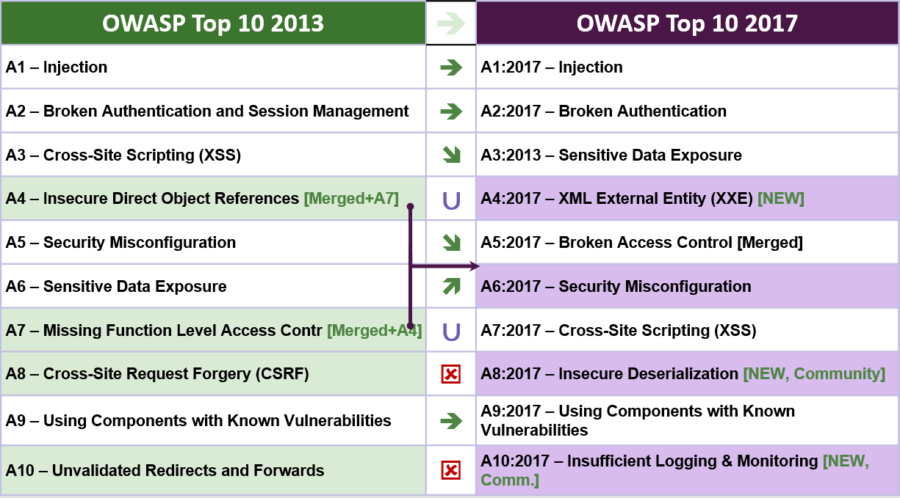

# RN Release Notes
## What changed from 2013 to 2017?

Change has accelerated over the last four years, and the OWASP Top 10 needed to change. We've completely refactored the OWASP Top 10, revamped the methodology, utilized a new data call process, worked with the community, re-ordered our risks, re-written each risk from the ground up, and added references to frameworks and languages that are now commonly used. 

Over the last decade, and in particularly these last few years, the fundamental architecture of applications has changed significantly:

* JavaScript is now the primary language of the web. node.js and modern web frameworks such as Bootstrap, Electron, Angular, React amongst many others, means source that was once on the server is now running on untrusted browsers.
* Single page applications, written in JavaScript frameworks such as Angular and React, allow the creation of highly modular front end user experiences, not to mention the rise and rise of mobile applicationss using the same APIs as single page applications.
* Microservices written in node.js and Spring Boot are replacing older enterprise service bus applications using EJBs and so on. Old code that never expected to be communicated with directly from the Internet is now sitting behind an API or RESTful web service. The assumptions that underlie this code, such as trusted callers, are simply no longer valid.

**New issues, supported by data**

* **A4:2017 - XML External Entities (XXE)** is a new category primarily supported by [SAST](https://www.owasp.org/index.php/Source_Code_Analysis_Tools) data sets. 

**New issues, supported by the community**

We asked the community to provide insight into two forward looking weakness categories. After 516 peer submissions, and  removing issues that were already supported by data (such as Sensitive Data Exposure and XXE), the two new issues are 

* **A8:2017 - Insecure Deserialization**, responsible for one of the worst breaches of all time, and
* **A10:2017 - Insufficient Logging and Monitoring**, the lack of which can prevent or significantly delay malicious activity and breach detection, incident response and digital forensics.

**Retired, but not forgotten**

* **A4-Insecure direct object references** and **A7-Missing function level access control** merged into **A5:2017-Broken Access Control**.
* **A8-Cross-Site Request Forgery (CSRF)**. Less than 5% of the data set supports CSRF today, which places it around #13 
* **A10-Unvalidated redirects and forwards**. Less than 1% of the data set supports this issue today, as it's now #25

