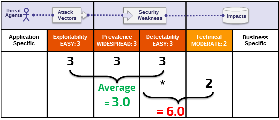

# +R Note About Risks

## It's About the Risks that Weaknesses Represent

The Risk Rating methodology for the Top 10 is based on the[OWASP Risk Rating Methodology](https://www.owasp.org/index.php/OWASP_Risk_Rating_Methodology). For each Top 10 category, we estimated the typical risk that each weakness introduces to a typical web application by looking at common likelihood factors and impact factors for each common weakness. We then ordered the Top 10 according to those weaknesses that typically introduce the most significant risk to an application. These factors get updated with each new Top 10 release as things change and evolve.

The [OWASP Risk Rating Methodology](https://www.owasp.org/index.php/OWASP_Risk_Rating_Methodology) defines numerous factors to help calculate the risk of an identified vulnerability. However, the Top 10 must talk about generalities, rather than specific vulnerabilities in real applications and APIs. Consequently, we can never be as precise as system owners can be when calculating risks for their application(s). You are best equipped to judge the importance of your applications and data, what your threats are, and how your system has been built and is being operated.

Our methodology includes three likelihood factors for each weakness (prevalence, detectability, and ease of exploit) and one impact factor (technical impact). The risk scales for each factor range from 1-Low to 3-High with terminology specific for each factor. The prevalence of a weakness is a factor that you typically don't have to calculate. For prevalence data, we have been supplied prevalence statistics from a number of different organizations (as referenced in the Acknowledgements on page 25), and we have aggregated their data together to come up with a Top 10 likelihood of existence list by prevalence. This data was then combined with the other two likelihood factors (detectability and ease of exploit) to calculate a likelihood rating for each weakness. The likelihood rating was then multiplied by our estimated average technical impact for each item to come up with an overall risk ranking for each item in the Top 10 (the higher the result the higher the risk). Detectability, Ease of Exploit, and Impact were calculated from analyzing reported CVEs that were associated with each of the Top 10 categories. 

**Note**: This approach does not take the likelihood of the threat agent into account. Nor does it account for any of the various technical details associated with your particular application. Any of these factors could significantly affect the overall likelihood of an attacker finding and exploiting a particular vulnerability. This rating does not take into account the actual impact on your business. Your organization will have to decide how much security risk from applications and APIs the organization is willing to accept given your culture, industry, and regulatory environment. The purpose of the OWASP Top 10 is not to do this risk analysis for you.

The following illustrates our calculation of the risk for **A6:2017-Security Misconfiguration**

