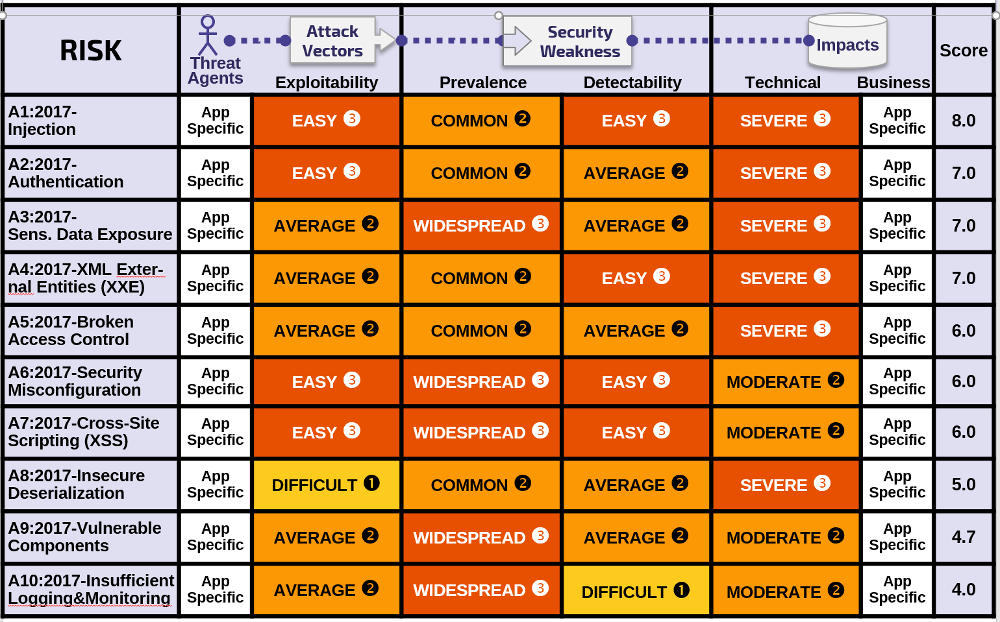

# +RF Details About Risk Factors

## Top 10 Risk Factor Summary

The following table presents a summary of the 2017 Top 10 Application Security Risks, and the risk factors we have assigned to each risk. These factors were determined based on the available statistics and the experience of the OWASP Top 10 team. To understand these risks for a particular application or organization, *you must consider your own specific threat agents and business impacts*. Even severe software weaknesses may not present a serious risk if there are no threat agents in a position to perform the necessary attack or the business impact is negligible for the assets involved.

## Additional Risks To Consider

The Top 10 covers a lot of ground, but there are many other risks you should consider and evaluate in your organization. Some of these have appeared in previous versions of the Top 10, and others have not, including new attack techniques that are being identified all the time.  Other important application security risks (in alphabetical order) that you should additionally consider include:

* Application Denial of Service (AppDoS) [CWE-400]
* Cross-Site Request Forgery (CSRF) [CWE-352]
* Improper Control of Interaction Frequency (Anti-Automation) [CWE-799]
* Inclusion of Functionality from Untrusted Control Sphere (3rd Party Content) [CWE-829]
* Server-Side Request Forgery (SSRF) [CWE-918]
* Unrestricted Upload of File with Dangerous Type [CWE-434]
* Unvalidated Forward and Redirects [CWE-601]
* User Interface (UI) Misrepresentation of Critical Information (Clickjacking and others) [CWE-451]

