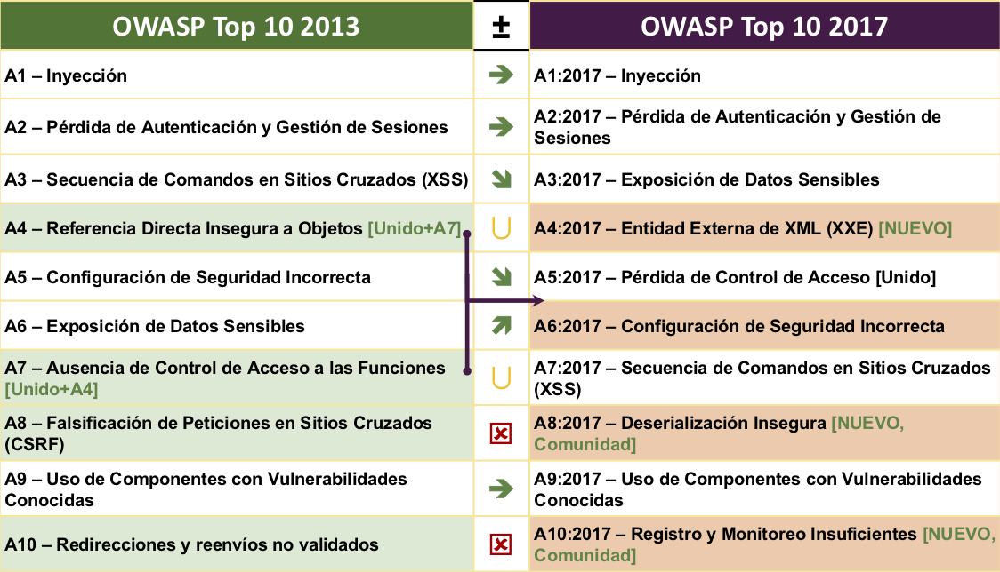

# RN Notas sobre la versión

## ¿Que ha cambiado de 2013 a 2017?

Los cambios se han acelerado en los últimos cuatro años, y OWASP Top 10 necesitaba actualizarse. Hemos rediseñado completamente a OWASP Top 10, mejorado la metodología, utilizado un nuevo proceso de pedido de datos, trabajamos con la comunidad, reordenamos los riesgos, reescribimos cada uno de los riesgos desde cero, y agregamos referencias a marcos de trabajo y lenguajes que son utilizados actualmente

En los últimos años, la tecnología base y la arquitectura de las aplicaciones ha cambiado significativamente:

* Micro servicios escritos en node.js y Spring Boot están reemplazando las aplicaciones monolíticas tradicionales. Los micro servicios vienen con sus propios desafíos de seguridad, incluyendo el establecimiento de confianza entre microservicios, contenedores, gestión de secretos, etc. El antiguo código que nunca esperó ser accesible desde Internet se encuentra ahora detrás de un API o servicio REST esperando a ser consumido por aplicaciones de una sola página (SPAs) y aplicaciones móviles. Supuestos arquitectónicos realizados al codificar, como las llamadas confiables, ya no son válidas.
* Las aplicaciones de una sola página, escritas en marcos JavaScript como Angular y React, permiten la creación de interfaces de usuario altamente modulares y ricos en funciones. Funcionalidades en el lado del cliente que tradicionalmente se han implementado en el  servidor, traen consigo sus propios desafíos de seguridad.
* JavaScript es ahora el lenguaje principal de la web con node.js ejecutando el lado del servidor y los Frameworks web modernos como Bootstrap, Electron, Angular y React ejecutándose en el cliente.

## Nuevos riesgos, respaldados en datos

* **A4:2017 - Entidades Externas XML (XXE)** es una nueva categoría, principalmente respaldado por los resultados obtenidos de las herramientas de análisis estático de código ([SAST](https://www.owasp.org/index.php/Source_Code_Analysis_Tools)). 

## Nuevos riesgos, respaldados por la comunidad

Le pedimos a la comunidad que nos proporcionara información sobre dos categorías de debilidades. Luego de más de 500 envíos, y de eliminar los problemas que ya estaban respaldados por datos (tales como Exposición a Datos Sensibles y XXE), los dos nuevos riesgos son: 

* **A8:2017 – Deserialización Insegura**, la que permite ejecución remota de código o la manipulación de objetos sensibles en la plataforma afectada. 
* **A10:2017 – Registro y Monitoreo Insuficientes**, la falta de estos aspectos puede impedir o demorar en forma significativa la detección de actividad maliciosa o de la sustracción de datos, la respuesta a los incidentes y la investigación forense digital.

## Fusionados o retirados, pero no olvidados

* **A4 – Referencia Directa Insegura a Objetos** y **A7 – Ausencia de Control de Acceso a las Funciones** fueron fusionados en **A5:2017 Pérdida de Control de Acceso**.
* **A8 – Falsificación de PeCciones en SiCos Cruzados (CSRF)** dado que varios Frameworks incluyen defensas contra [CSRF](https://www.owasp.org/index.php/Cross-Site_Request_Forgery_ (CSRF)), sólo se encontró en el 5% de las aplicaciones.
* **A10 – Redirecciones y reenvíos no validados** mientras que se encuentra en aproximadamente el 8% de las aplicaciones, fue superado ampliamente por XXE.

