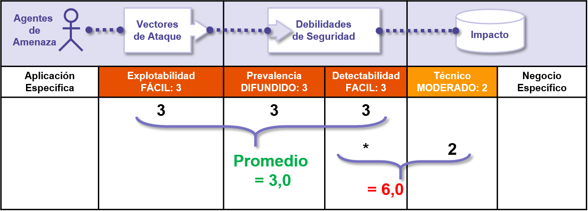

# +R Notas sobre los riesgos

## Es sobre los riesgos que conllevan las vulnerabilidades

La Metodología de Evaluación del Riesgo para el Top 10 está basada en la [Metodología de Evaluación de Riesgo de OWASP](https://wiki.owasp.org/index.php/OWASP_Risk_Rating_Methodology). Para cada categoría del TOP 10, estimamos que el riesgo típico que presenta cada vulnerabilidad en una aplicación web típica al observar los factores de probabilidad comunes y los factores de impacto para cada vulnerabilidad común. Luego, ordenamos el Top 10 de acuerdo a todas aquellas vulnerabilidades que típicamente presentan el riesgo más significativo para una aplicación. Estos factores son actualizados con cada edición del Top 10 a medida que cambian y evolucionan.

La [Metodología de Evaluación de Riesgo de OWASP](https://wiki.owasp.org/index.php/OWASP_Risk_Rating_Methodology) define numerosos factores para ayudar a calcular el riesgo de una vulnerabilidad identificada. Sin embargo, el Top 10 debe basarse en generalidades en lugar de vulnerabilidades específicas en aplicaciones y APIs reales. En consecuencia, nunca podremos ser tan precisos como el propietario o el administrador del sistema para calcular los riesgos para su(s) aplicación(es). Éstos mejor capacitados para juzgar la importancia de sus aplicaciones y datos, cuáles son sus amenazas, y cómo su sistema ha sido construido y cómo está siendo operado.

Nuestra metodología incluye tres factores de probabilidad para cada vulnerabilidad (prevalencia, posibilidad de detección y facilidad de explotación) y un factor de impacto (impacto técnico). La escala de riesgos para cada factor utiliza el rango de 1 (bajo) a 3 (alto). La prevalencia de una vulnerabilidad es un factor que normalmente no es necesario calcular. Para los datos de prevalencia, se han proporcionado estadísticas de prevalencia de un conjunto de organizaciones distintas (como se menciona en la sección de Agradecimientos en la página 25) y hemos calculado el promedio de sus datos agregados para elaborar el Top 10 de probabilidad de existencia según la prevalencia. Esta información fue posteriormente combinada con los dos factores de probabilidad (posibilidad de detección y facilidad de explotación) para calcular la tasa de probabilidad de cada vulnerabilidad. Esta tasa de probabilidad fue multiplicada por el impacto técnico promedio estimado para cada elemento para elaborar una clasificación de riesgo total para cada elemento en el Top 10 (cuanto mayor sea el resultado, mayor será el riesgo).La Detectabilidad, la Facilidad de Explotación y el Impacto se calcularon analizando los CVEs reportados que estaban asociados con cada una de las 10 categorías principales.

**Nota**: Tenga en consideración que éste enfoque no tiene en cuenta la probabilidad de que el agente de amenaza. Tampoco se tiene en cienta ninguno de los detalles técnicos asociados a su aplicación en particular. Cualquiera de éstos factores podrían afectar significativamente la probabilidad total de que un atacante encuentre y explote una vulnerabilidad en particular. Ésta clasificación tampoco tiene en consideración el impacto real sobre su negocio. Su organización deberá decidir cuánto riesgo de seguridad en las aplicaciones y APIs está dispuesta a asumir dada su cultura, la industria, y el entorno regulatorio. El propósito de OWASP Top 10 no es hacer el análisis de riesgo por usted.

El siguiente diagrama ilustra los cálculos del riesgo de **A6:2017 Configuración de Seguridad Incorrecta**.

