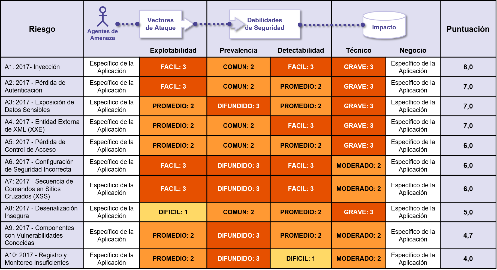

# +RF Detalles Acerca de los Factores de Riesgo

## Resumen de Factores de Riesgo del Top 10

La siguiente tabla presenta un resumen del Top 10 de Riesgos de Seguridad en Aplicaciones 2017, y los factores de riesgo que hemos asignado a cada uno de ellos. Estos factores fueron determinados basándose en las estadísticas disponibles y la experiencia del equipo del Top 10 de OWASP. Para entender éstos riesgos para una aplicación en particular u organización, usted debe considerar sus propios agentes de amenaza de impactos de negocio específicos. Incluso vulnerabilidades de software graves podrían no representar un riesgo serio si no hay agentes de amenaza en posición para ejecutar el ataque necesario, o el impacto de negocio es insignificante para los activos involucrados.

## Riesgos Adicionales a Considerar

El TOP 10 abarca un amplio espectro, pero existen otros riesgos que debería considerar y evaluar en su organización. Algunos de éstos se han publicado en versiones previas del Top 10, y otros no, incluyendo nuevas técnicas de ataque que son identificadas constantemente. Otros riesgos de seguridad en aplicaciones importantes (ordenados según su identificador de CWE) que también debería considerar:

- [CWE-352: Falsificación de Peticiones en Sitios Cruzados (CSRF)](https://cwe.mitre.org/data/definitions/352.html)
- [CWE-400: Consumo de Recursos sin Control ('Agotamiento de Recursos', 'AppDoS')](https://cwe.mitre.org/data/definitions/400.html)
- [CWE-434: Carga de Archivos de Tipos Peligrosos sin Restricciones](https://cwe.mitre.org/data/definitions/434.html)
- [CWE-451: Mal Representación de información crítica en la Interfaz de Usuario (UI) - Clickjacking y otros](https://cwe.mitre.org/data/definitions/451.html)
- [CWE-601: Redirecciones y Reenvios no Validados](https://cwe.mitre.org/data/definitions/601.html)
- [CWE-799: Control Inapropiado sobre la Frecuencia de Interacción (Anti-Automation)](https://cwe.mitre.org/data/definitions/799.html)
- [CWE-829: Inclusión de Funcionalidades desde fuera del la zona controlada de confianza (Contenido de Terceros)](https://cwe.mitre.org/data/definitions/829.html)
- [CWE-918: Falsificación de Peticiones desde el lado del Servidor (SSRF)](https://cwe.mitre.org/data/definitions/918.html)
