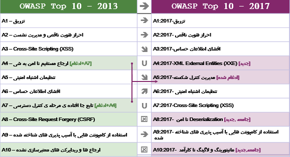

# 
نکات این نسخه
 

## 
از 2013 تا 2017 چه چیزهایی تغییر کرده اند؟

تغییرات در سال های اخیر شتاب گرفته اند و OWASP TOP 10 به تغییر احتیاج داشت. ما به صورت کامل OWASP TOP 10 را از لحاظ ساختاری تغییر داده‌ایم و روش آن را مورد بازنگری قرار داده‌ایم. یک فرآیند درخواست داده که با جامعه در ارتباط است تعیین کرده‌ایم، ‌ خطرات را مجدداً در دستور کار قرار داده‌ایم و هر خطر را مجدداً از ابتدا نوشته‌ایم و به فریمورک‌ها و زبان‌هایی که در حال حاضر به طور عمومی‌استفاده می‌شوند منابعی را اضافه کرده ایم.

در طی سال‌های اخیر، تکنولوژی و معماری اولیه‌ی برنامه ها به صورت چشمگیری تغییر یافته است:

<ul dir="rtl" align="right">
  <li>
  میکروسرویس‌های نوشته شده درnode.js  و Spring Boot در حال جایگزین شدن به جای برنامه های سنتی یکپارچه هستند. میکروسرویس‌ها با چالش‌های امنیتی خودشان مواجه هستند که شامل برقراری اعتماد بین میکروسرویس ها، کانتینرها، مدیریت امنیت و... می‌شود. کد قدیمی‌که هرگز انتظار نمیرفت تا از طریق اینترنت قابل دسترسی باشد، ‌حالا پشت  APIها و وب سرویس RESTful قرار گرفته تا توسط برنامه های تک صفحه‌ای (SPAs) و برنامه‌های موبایل مورد استفاده قرار گیرد. فرض‌های معماری توسط کد، مثل درخواست کننده های مورد اعتماد، دیگر معتبر نیستند.
  </li>
  <li>
    برنامه های تک صفحه‌ای که در API جاواسکریپت نوشته شده اند، مثل Angular و React، اجازه خلق ظاهر بسیار ماژولار و پر از ویژگی را می‌دهند. عملکرد سمت کلاینت که به صورت سنتی در سمت سرور تحویل می‌شده است، چالش های امنیتی خاص خود را به همراه دارد.
  </li>
   <li>
    جاواسکریپت حالا زبان اولیه وب است، با node.js  که در سمت سرور اجرا می‌شود و وب فریمورک هایی نظیر Bootstrap، ‌ Electron، Angular، و React که در سمت کلاینت اجرا میشوند.
  </li>
</ul>

## 
مشکلات جدیدی که با داده پشتیبانی می‌شوند:

<ul dir="rtl" align="right">
  <li>
    <strong> A4:2017-XML External Entities (XXE)</strong>
   یک دسته بندی جدید است که به صورت اولیه توسط مجموعه داده <a href="https://www.owasp.org/index.php/Source_Code_Analysis_Tools">ابزارهای آنالیز و آزمون امنیت کد منبع (SAST)</a>  پشتبانی می‌شود.
  </li>
</ul>

## 
مشکلات جدیدی که توسط جامعه پشتیبانی میشوند:

ما از جامعه خواستیم که نگاه دقیقی به ۲ دسته بندی از ضعف های پیش رو داشته باشند. بعد از بیش از ۵۰۰ توافق دو طرفه، و حذف مشکلاتی که توسط داده پشتیبانی می‌شوند (مثل افشای اطلاعات حساس و XXE )، دو مشکل جدید عبارتند از: 

<ul dir="rtl" align="right">
  <li>
    <strong>A8:2017-  Deserialization نا امن </strong>
    که اجازه اجرای کد از راه دور یا دستکاری اشیاء حساس را در پلتفرم های تحت تأثیرش می‌دهد.
  </li>
  <li>
    <strong>A10:2017-  رویدادنگاری و پایش نا کارآمد </strong>
    که باعث جلوگیری یا تاخیر قابل توجه کشف فعالیت های مشکوک و رخنه ها، واکنش به حوادث، و جرم شناسی دیجیتال می‌شود.
  </li>
</ul>

## 
ترکیب شده یا بازنشسته شده، اما فراموش نشده : 
 

<ul dir="rtl" align="right">
  <li>
    <strong>A4-Insecure Direct Object References </strong>
    و
    <strong>A7-Missing Function Level Access Control </strong>
    ادغام شده اند به
    <strong>A5:2017-Broken Access Control</strong>
  </li>
  <li>
    <strong>A8-Cross-Site Request Forgery (CSRF)</strong> ,
    از آنجایی که فریمورک های بسیاری دارای 
    <a href="https://www.owasp.org/index.php/Cross-Site_Request_Forgery_(CSRF)">محافظ CSRF</a>
    هستند ، این مورد تنها در ۵ درصد از برنامه های کاربردی یافت شده است .
  </li>
  <li>
    <strong>ارجاع‌ها و هدایت‌های نامعتبرA10- </strong>,
   از آنجایی که در تقریباً ۸ درصد از برنامه های کاربردی یافت شد، ‌به طور کلی به صورت XXE ارائه شد.
  </li>
</ul>

