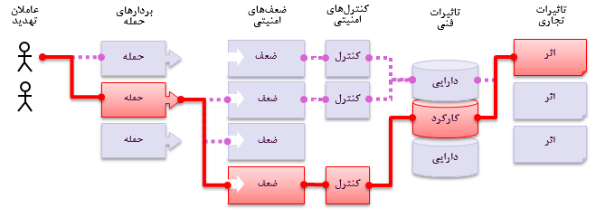

# 
مخاطرات امنیتی برنامه‌های کاربردی

## 
خطرات امنیتی برنامه چیست؟

مهاجمان به طور بالقوه می‌توانند از راه‌‌های مختلفی از طریق برنامه کاربردی شما، به کسب و کار یا سازمان شما آسیب برسانند. هر یک از این راه‌ها بیانگر یک خطر است که ممکن است به اندازه کافی جدی باشد تا به آن توجه شود.

گاهی اوقات این مسیرها بسیار راحت مشخص می‌شوند و گاهی اوقات بسیار دشوار است. به طور مشابه، آسیب ناشی از آن ممکن است هیچ نتیجه ای نداشته باشد، یا ممکن است شما را از کسب و کار بیرون کند. برای تعیین خطر برای سازمان شما می توانید احتمال را با هر عامل تهدید، بردار حمله و ضعف امنیتی مرتبط کنید و آن را با برآورد اثرات فنی و تجاری سازمان خود ترکیب کنید. این عوامل با هم، ریسک کلی شما را تعیین می کنند.

## 
ریسک من چیست؟

<a href="https://www.owasp.org/index.php/Top10">OWASP Top 10</a> به شناسایی جدی ترین خطرات برای مجموعه وسیعی از سازمان ها متمرکز است. برای هر یک از این خطرات، ما اطلاعات کلی درباره احتمال و تأثیر فنی را با استفاده از رهنمود ساده ارزیابی می کنیم که بر اساس روش رتبه بندی ریسک OWASP است.
 

| عوامل تهدید | قابل بهره‌برداری بودن | شیوع ضعف | قابل تشخیص بودن ضعف | اثر تکنیکال | تاثیرات کسب و کار |
| -- | -- | -- | -- | -- | -- |
| ویژه -   | ساده: ۳ | شایع: ۳ | ساده: ۳ | شدید: ۳ | مختص -     |
|  برنامه -  | متوسط: ۲ | عمومی: ۲ | متوسط: ۲ | متعادل: ۲ | کسب و -  |
|     کاربردی   | سخت: ۱ | نادر: ۱ | سخت: ۱ | جزئی: ۱ |     کار   |

در این نسخه، سیستم رتبه بندی ریسک را به روز کرده ایم تا در محاسبه احتمال (likelihood) و تاثیر هر گونه ریسک داده شده کمک کنیم. برای اطلاعات بیشتر، لطفا <a href="0xc0-note-about-risks.md">در مورد ریسک</a> را ببینید.

هر سازمان منحصر به فرد است و تهدید کننده برای این سازمان، اهداف آنها و تأثیر هر گونه نقض نیز دارند. اگر سازمان منافع عمومی با استفاده از یک سیستم مدیریت محتوا (CMS) برای اطلاعات عمومی و یک سیستم سالم از همان CMS دقیق برای رکورد های سالم حساس استفاده کند،  تهدید کننده ها و تاثیرات تجاری می توانند برای یک نرم افزار بسیار متفاوت باشند. درک خطرات سازمان شما بر اساس عوامل تهدید قابل اجرا و تاثیرات تجاری بسیار مهم است.

در صورت امکان، نام ریسک ها در Top 10 با ضعف های عمومی <a href="https://cwe.mitre.org/">Weakness Enumeration (CWE)</a> به منظور ارتقای شیوه های پذیرفته شده امنیتی و کاهش سردرگمی مطابقت دارد.

## 
منابع

### 

OWASP

* [OWASP Risk Rating Methodology](https://www.owasp.org/index.php/OWASP_Risk_Rating_Methodology)
* [Article on Threat/Risk Modeling](https://www.owasp.org/index.php/Threat_Risk_Modeling)

### 
خارجی
 

* [ISO 31000: Risk Management Std](https://www.iso.org/iso-31000-risk-management.html)
* [ISO 27001: ISMS](https://www.iso.org/isoiec-27001-information-security.html)
* [NIST Cyber Framework (US)](https://www.nist.gov/cyberframework)
* [ASD Strategic Mitigations (AU)](https://www.asd.gov.au/infosec/mitigationstrategies.htm)
* [NIST CVSS 3.0](https://nvd.nist.gov/vuln-metrics/cvss/v3-calculator)
* [Microsoft Threat Modelling Tool](https://www.microsoft.com/en-us/download/details.aspx?id=49168)
