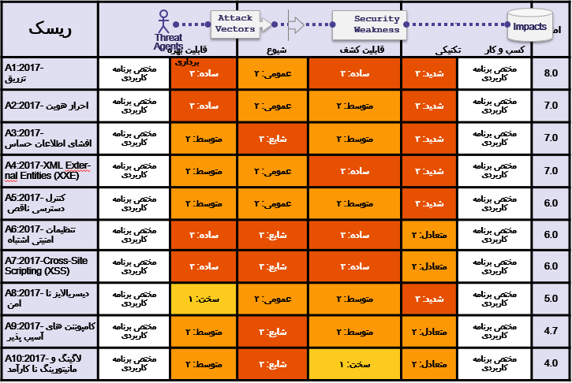

# 
+RF جزئیاتی در مورد فاکتورهای ریسک 

## 
خلاصه ۱۰ فاکتور ریسک برتر

جدول پیش رو خلاصه ای از ۱۰ خطر برتر امنیتی ۲۰۱۷ و فاکتورهای ریسکی که ما به انها اضافه نموده‌ایم را نمایش میدهد. این فاکتورها بر اساس آمارهای قابل دسترس و همینطور تجربه ی تیم OWASP TOP 10  تعیین شده اند.برای درک این خطرها برای برنامه یا سازمان، باید تهدیدات داخلی و تاثیرات کسب و کار خود را مورد نظر قرار دهید. حتی ضعف های امنیتی شدید هم ممکن است خطر جدی به همراه نداشته باشند ، اگر که هیچ تهدیدی در موقعیت حمله قرار نداشته باشد و یا تاثیر کسب و کار بر دارایی هایی که مشمول هستند ناچیز باشد.

## 
ریسک اضافه قابل توجه

TOP 10 زمینه های بسیاری را پوشش میدهد، اما ریسک های دیگری نیز وجود دارند که باید آنها را در نظر داشته و در سازمان خود ارزیابی نمایید.بعضی از اینها در نسخه های قبلی TOP 10  وجود دارند و برخی نه، که شامل تکنیک های جدید حمله که همیشه شناسایی میشوند است. مابقی ریسک های امنیتی برنامه کاربردی (به ترتیب CVE-ID) که شما باید به صورت اضافی در نظر بگیرید شامل این موارد هستند :

* [CWE-352: Cross-Site Request Forgery (CSRF)](https://cwe.mitre.org/data/definitions/352.html)
* [CWE-400: Uncontrolled Resource Consumption ('Resource Exhaustion', 'AppDoS')](https://cwe.mitre.org/data/definitions/400.html)
* [CWE-434: Unrestricted Upload of File with Dangerous Type](https://cwe.mitre.org/data/definitions/434.html)
* [CWE-451: User Interface (UI) Misrepresentation of Critical Information (Clickjacking and others)](https://cwe.mitre.org/data/definitions/451.html)
* [CWE-601: Unvalidated Forward and Redirects](https://cwe.mitre.org/data/definitions/601.html)
* [CWE-799: Improper Control of Interaction Frequency (Anti-Automation)](https://cwe.mitre.org/data/definitions/799.html)
* [CWE-829: Inclusion of Functionality from Untrusted Control Sphere (3rd Party Content)](https://cwe.mitre.org/data/definitions/829.html)
* [CWE-918: Server-Side Request Forgery (SSRF)](https://cwe.mitre.org/data/definitions/918.html)

