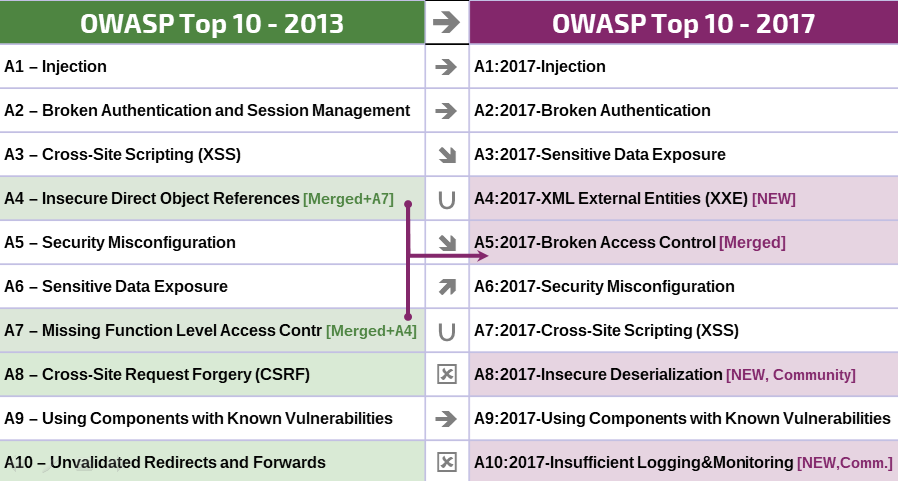

# RN Notes de Version

## What changed from 2013 to 2017?

Change has accelerated over the last four years, and the OWASP Top 10 needed to change. We've completely refactored the OWASP Top 10, revamped the methodology, utilized a new data call process, worked with the community, re-ordered our risks, re-written each risk from the ground up, and added references to frameworks and languages that are now commonly used.

Over the last few years, the fundamental technology and architecture of applications has changed significantly:

* Microservices written in node.js and Spring Boot are replacing traditional monolithic applications. Microservices come with their own security challenges including establishing trust between microservices, containers, secret management, etc. Old code never expected to be accessible from the Internet is now sitting behind an API or RESTful web service to be consumed by Single Page Applications (SPAs) and mobile applications. Architectural assumptions by the code, such as trusted callers, are no longer valid.
* Single page applications, written in JavaScript frameworks such as Angular and React, allow the creation of highly modular feature-rich front ends. Client-side functionality that has traditionally been delivered server-side brings its own security challenges.
* JavaScript is now the primary language of the web with node.js running server side and modern web frameworks such as Bootstrap, Electron, Angular, and React running on the client.

## New issues, supported by data

* **A4:2017-XML External Entities (XXE)** is a new category primarily supported by source code analysis security testing tools ([SAST](https://www.owasp.org/index.php/Source_Code_Analysis_Tools)) data sets.

## New issues, supported by the community

We asked the community to provide insight into two forward looking weakness categories. After over 500 peer submissions, and removing issues that were already supported by data (such as Sensitive Data Exposure and XXE), the two new issues are: 

* **A8:2017-Insecure Deserialization**, which permits remote code execution or sensitive object manipulation on affected platforms.
* **A10:2017-Insufficient Logging and Monitoring**, the lack of which can prevent or significantly delay malicious activity and breach detection, incident response, and digital forensics.

## Merged or retired, but not forgotten

* **A4-Insecure Direct Object References** and **A7-Missing Function Level Access Control** merged into **A5:2017-Broken Access Control**.
* **A8-Cross-Site Request Forgery (CSRF)**, as many frameworks include [CSRF defenses](https://www.owasp.org/index.php/Cross-Site_Request_Forgery_(CSRF)), it was found in only 5% of applications.
* **A10-Unvalidated Redirects and Forwards**, while found in approximately in 8% of applications, it was edged out overall by XXE.

