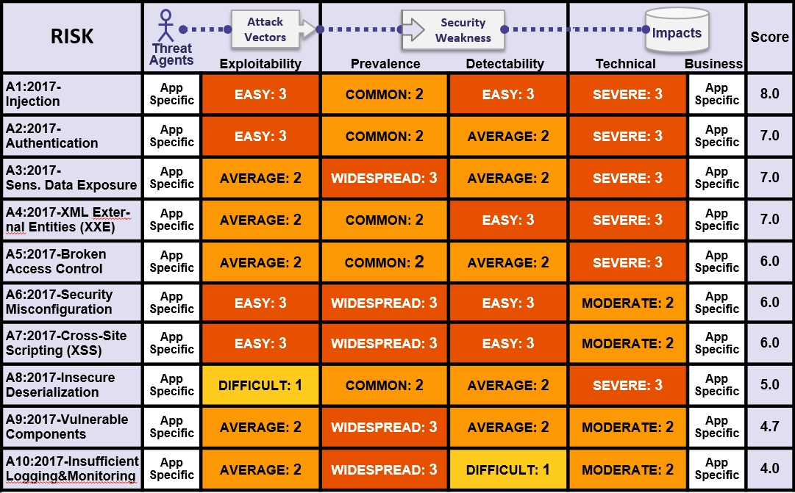

# +RF Rincian Tentang Faktor Risiko

## Ringkasan Faktor Risiko Top 10

Tabel berikut menyajikan ringkasan Resiko Keamanan Aplikasi 10 Teratas 2017, dan faktor risiko yang telah kami berikan pada setiap risiko. Faktor-faktor ini ditentukan berdasarkan statistik yang ada dan pengalaman tim OWASP Top 10. Untuk memahami risiko ini untuk aplikasi atau organisasi tertentu, Anda harus mempertimbangkan suatu ancaman dan bisnis Anda sendiri. Bahkan kelemahan perangkat lunak yang cukup parah mungkin tidak menimbulkan risiko serius jika tidak ada suatu ancaman dalam posisi untuk tidak melakukan serangan yang diperlukan atau dampak bisnis menjadi pertimbangan agar dapat diabaikan untuk aset yang penting.

## Risiko Tambahan Yang Harus Dipertimbangkan

Top 10 mencakup banyak hal, namun ada banyak risiko lain yang harus Anda pertimbangkan dan evaluasi di organisasi Anda. Beberapa di antaranya telah muncul di versi 10 Teratas sebelumnya, dan yang lainnya tidak, termasuk teknik serangan baru yang diidentifikasi setiap saat. Risiko keamanan aplikasi penting lainnya (diurutkan dari CWE-ID) yang harus Anda pertimbangkan selain mencakup:

* [CWE-352: Cross-Site Request Forgery (CSRF)](https://cwe.mitre.org/data/definitions/352.html)
* [CWE-400: Uncontrolled Resource Consumption ('Resource Exhaustion', 'AppDoS')](https://cwe.mitre.org/data/definitions/400.html)
* [CWE-434: Unrestricted Upload of File with Dangerous Type](https://cwe.mitre.org/data/definitions/434.html)
* [CWE-451: User Interface (UI) Misrepresentation of Critical Information (Clickjacking and others)](https://cwe.mitre.org/data/definitions/451.html)
* [CWE-601: Unvalidated Forward and Redirects](https://cwe.mitre.org/data/definitions/601.html)
* [CWE-799: Improper Control of Interaction Frequency (Anti-Automation)](https://cwe.mitre.org/data/definitions/799.html)
* [CWE-829: Inclusion of Functionality from Untrusted Control Sphere (3rd Party Content)](https://cwe.mitre.org/data/definitions/829.html)
* [CWE-918: Server-Side Request Forgery (SSRF)](https://cwe.mitre.org/data/definitions/918.html)

