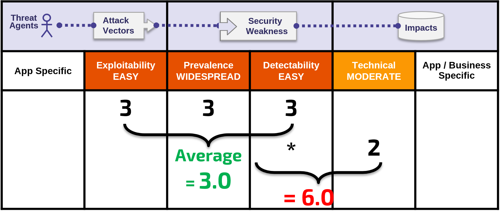

# +R Notas Sobre Riscos

## É Sobre os Riscos Que as Vulnerabilidades Representam

A metodologia de classificação de risco para o Top 10 é baseada na [Metodologia de Classificação de Risco OWASP](https://owasp.org/www-community/OWASP_Risk_Rating_Methodology). Para cada categoria de Top 10, estimamos o risco típico de que cada vulnerabilidade introduz em uma aplicação web típica, observando fatores de probabilidade comuns e fatores de impacto para cada vulnerabilidade comum. Em seguida, ordenamos o Top 10 de acordo com essas vulnerabilidades que tipicamente apresentam o risco mais significativo para uma aplicação. Esses fatores são atualizados com cada novo lançamento do Top 10 à medida que as coisas mudam e evoluem.

A [Metodologia de Classificação de Risco OWASP](https://owasp.org/www-community/OWASP_Risk_Rating_Methodology) define numerosos fatores para ajudar a calcular o risco de uma vulnerabilidade identificada. No entanto, o Top 10 deve falar sobre generalidades, em vez de vulnerabilidades específicas em aplicações reais e APIs. Conseqüentemente, nunca podemos ser tão precisos como os proprietários do sistema podem ser ao calcular riscos para suas aplicações. Você está melhor equipado para avaliar a importância de suas aplicações e dados, quais são suas ameaças e como seu sistema foi criado e está sendo operado.

Nossa metodologia inclui três fatores de probabilidade para cada vulnerabilidade (prevalência, detectabilidade e facilidade de exploração) e um fator de impacto (impacto técnico). As escalas de risco para cada fator variam de 1-Baixo a 3-Alto com terminologia específica para cada fator. A prevalência de uma vulnerabilidade é um fator que você geralmente não precisa calcular. Para dados de prevalência, foram fornecidas estatísticas de prevalência de várias organizações diferentes (como referenciado nos Agradecimentos na página 25) e agregamos seus dados juntos para apresentar uma lista de probabilidade de existência de Top 10 por prevalência. Estes dados foram então combinados com os outros dois fatores de probabilidade (detectabilidade e facilidade de exploração) para calcular uma classificação de probabilidade para cada vulnerabilidade. A classificação de probabilidade foi então multiplicada pelo nosso impacto técnico médio estimado para cada item para chegar a uma classificação geral de risco para cada item no Top 10 (quanto maior o resultado, mais alto o risco). A detecção, a facilidade de exploração e o impacto foram calculados a partir da análise de CVEs relatados que foram associados a cada uma das categorias do Top 10.

**Nota**: Esta abordagem não leva em conta a probabilidade do agente da ameaça. Também não conta nenhum dos vários detalhes técnicos associados à sua aplicação específica. Qualquer um desses fatores poderia afetar significativamente a probabilidade geral de um atacante encontrar e explorar uma vulnerabilidade particular. Esta classificação não leva em consideração o impacto real em sua empresa. Sua organização terá que decidir quanto risco de segurança de aplicações e APIs a organização está disposta a aceitar, dada a sua cultura, indústria e ambiente regulatório. A finalidade do OWASP Top 10 não é fazer esta análise de risco para você.

O seguinte ilustra o nosso cálculo do risco de **A6:2017 - Configuração Incorreta de Segurança**

