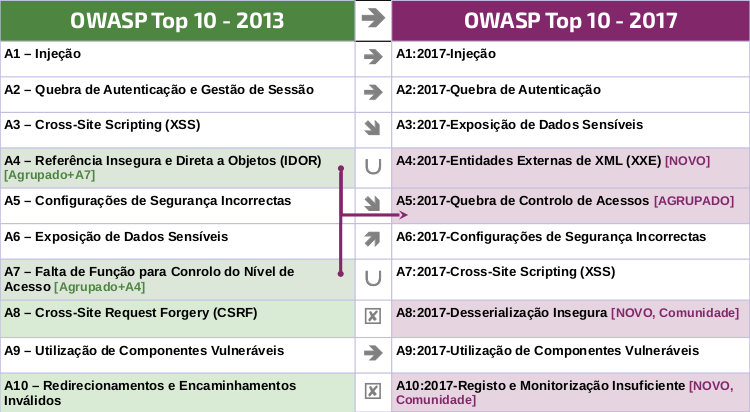

# RN Notas da Versão
## O que mudou de 2013 para 2017?

A mudança acelerou ao longo dos passados 4 anos, e o OWASP Top 10 precisava de mudar. Refactorizamos por completo o OWASP Top 10, actualizamos a metodologia, utilizou um novo processo de chamada de dados, trabalhou com a comunidade, reordenou os riscos, reescreveu cada risco e adicionou referências a frameworks e linguagens que são agora largamente usadas. 

Durante a década que passou, e em particular nestes últimos anos, a arquitectura fundamental das aplicações alterou-se de forma significativa:

* O JavaScript é agora a principal linguagem na web. O node.js e outras frameworks web modernas como Bootstrap, Electron, Angular, React entre outras, significa que código fonte que antes corria no servidor é agora executado em browsers pouco confiáveis.
* Aplicações de página única, escritas em frameworks de JavaScript tais como Angular e React, permitem a criação de experiências de utilização extremamente modulares, sem referir o crescimento de aplicações móveis que usam as mesmas APIs como aplicações de página única.
* Microserviços desenvolvidos em node.js e Spring Boot estão a substituir as antigas aplicações empresariais baseadas em serviços de barramento que usavam EJBs e outros semelhantes. Código antigo que nunca tinha sido desenhado para ser aberto à Internet está agora exposto através de uma API ou serviço REST. Os pressupostos que foram usados para a criação deste código, tais como invocadores de confiança, simplesmente já não são válidos.

**Novos problemas, suportados por dados**

* **A4:2017 - Entidades Externas de XML (XXE)** é uma nova categoria que é suportada principalmente pelos conjuntos de dados da SASTs. 

**Novos problemas, suportados pela comunidade**

Solicitamos à comunidade que fornecesse a sua opinião sobre duas categorias de fraquezas voltadas para o futuro. Após 516 submissões por pares e removendo alguns problemas que já eram suportados por dados (como Exposição de Dados Sensíveis e XXE), os dois novos problemas são

* **A8:2017 - De-serialização Insegura**, responsible for one of the worst breaches of all time, and
* **A10:2017 - Registo e Monitorização Insuficiente**, the lack of which can prevent or significantly delay malicious activity and breach detection, incident response and digital forensics.

**Removidos, mas não esquecidos**

* **A4 Referências Directas Inseguras a Objectos** e **A7 Falta de Controlo de Acesso ao Nível das Funções** juntaram-se dando origem a **A5:2017 - Quebra de Controlo de Acesso**.
* **A8 CSRF**. Menos de 5% dos dados obtidos suportam actualmente o CSRF, o que o coloca na posição #13 
* **A10 Redireccionamentos e Encaminhamentos Não Validados**. Menos de 1% dos dados obtidos suportam actualmente este problema, pelo que está agora na posição #25

