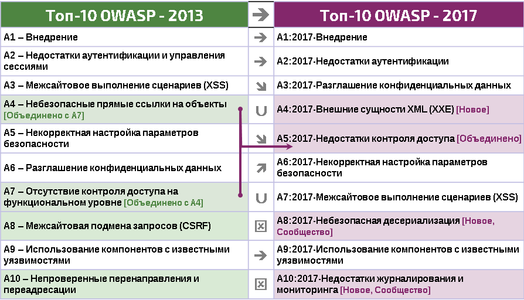

# ЧН Что нового

## Что изменилось в 2017 году по сравнению с 2013-м?

Многое изменилось за последние четыре года, поэтому Топ-10 OWASP также требовались изменения. Мы полностью реорганизовали Топ-10, обновили методологию, применили новый процесс сбора данных, наладили взаимодействие с сообществом, пересмотрели уровни значимости, переписали все угрозы с нуля и добавили ссылки на наиболее распространенные фреймворки и языки.

За последние годы основные технологии и архитектура приложений сильно изменились:

* Микросервисы, написанные на node.js и Spring Boot, заменяют традиционные монолитные приложения. С приходом микросервисов прибавилось проблем с безопасностью, таких как установление доверия между микросервисами, контейнерами, управление критически важными данными. Код, к которому раньше не предполагалось обращение через интернет, теперь располагается за API или веб-сервисами RESTful и может быть использован одностраничными и мобильными приложениями. Архитектурные допущения в коде, касающиеся, например, доверенных вызывающих функций, более не актуальны.
* Одностраничные приложения, разработанные с использованием JavaScript-фреймворков (таких как Angular и React), позволяют создавать многофункциональные, модульные интерфейсы. Функциональные возможности клиентов, которые традиционно обеспечивались на стороне сервера, также добавляют проблем с безопасностью.
* JavaScript в настоящее время является основным языком в интернете, node.js работает на стороне сервера, а современные веб-фреймворки (такие как Bootstrap, Electron, Angular и React) запускаются в клиентах.

## Новые угрозы, выделенные на основе данных

* **A4:2017-Внешние сущности XML (XXE)** — новая категория, выделенная на основе данных, полученных при помощи инструментов тестирования безопасности исходного кода ([SAST](https://owasp.org/www-community/Source_Code_Analysis_Tools)).

## Новые угрозы, выделенные сообществом

Мы попросили сообщество рассмотреть две перспективные категории угроз. Было получено более чем 500 рецензий, после исключения уже выделенных угроз (таких как "Разглашение конфиденциальных данных" и "Внешние сущности XML") были выбраны следующие категории:

* **A8:2017-Небезопасная десериализация**, которая позволяет удаленно выполнить код или осуществить действия с критически важными объектами.
* **A10:2017-Недостатки журналирования и мониторинга**, которые могут помешать обнаружению вредоносных действий или взломов, реагированию на инциденты, а также расследованию киберпреступлений.

## Объединенные или исключенные, но не забытые

* **A4-Небезопасные прямые ссылки на объекты** и **A7-Отсутствие контроля доступа на функциональном уровне** объединены в **A5:2017-Недостатки контроля доступа**.
* **A8-Межсайтовая подмена запросов (CSRF)** была обнаружена только в 5% приложений, поскольку большинство фреймворков имеют [средства защиты от CSRF](https://cheatsheetseries.owasp.org/cheatsheets/Cross-Site_Request_Forgery_Prevention_Cheat_Sheet.html).
* **A10-Непроверенные перенаправления и переадресации** были обнаружены примерно в 8% приложений, но данная категория была вытеснена __Внешними сущностями XML (XXE)__.

