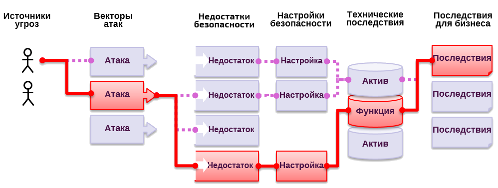

# **Угрозы** - Угрозы безопасности приложений

## Что представляют собой угрозы безопасности приложений?

Злоумышленники могут нанести ущерб вашему бизнесу или организации, используя ваше приложение тем или иным образом. Каждый из возможных способов представляет угрозу, которая может (или не может) быть достаточно серьезной, чтобы обратить на себя внимание.

Иногда эти способы легко найти и эксплуатировать, иногда — очень сложно. Аналогичная ситуация с возможным ущербом: его может не быть совсем либо он может лишить вас бизнеса. Чтобы определить риски для вашей организации, вы можете оценить вероятности, связанные с источниками угроз, векторами атак и недостатками безопасности, а затем объединить их с оценкой технического и репутационного вреда для вашей организации. Все вместе эти факторы определяют совокупный риск.

## Что мне грозит

Главная задача [Топ-10 OWASP](https://www.owasp.org/index.php/Top10) заключается в определении самых серьезных угроз безопасности веб-приложений для широкого круга организаций. Для каждой из этих угроз мы предоставляем общую информацию о вероятности ее возникновения и возможных технических последствиях, используя следующие простые методы оценки, основанные на [Методике оценки рисков OWASP](https://www.owasp.org/index.php/OWASP_Risk_Rating_Methodology).

| Источники угроз | Сложность эксплуатации | Распространенность уязвимости | Сложность обнаружения | Технические последствия | Последствия для бизнеса |
| -- | -- | -- | -- | -- | -- |
| Зависит   | Просто: 3 | Очень распространенная: 3 | Просто: 3 | Тяжелые: 3 | Зависит     |
|   от   | Средне: 2 | Распространенная: 2 | Средне: 2 | Умеренные: 2 | от |
| приложения | Сложно: 1 | Редкая: 1 | Сложно: 1 | Незначительные: 1 |   бизнеса    |

В этом издании мы обновили систему оценки рисков для облегчения расчета вероятности возникновения и возможного ущерба для любой угрозы. Более подробную информацию можно узнать в разделе [Об угрозах](0xc0-note-about-risks.md). 

Все организации уникальны, так же как и злоумышленники, их цели и последствия подобных атак. Если общественная организация использует некую систему управления контентом (CMS) для публикации информации, а система здравоохранения использует такую же систему для хранения медицинских данных, то угрозы и риски для бизнеса могут сильно отличаться в рамках одного ПО. Очень важно определить риски для вашей организации, исходя из применимых к ней угроз и возможных последствий атак.

Где это возможно, названия угроз в Топ-10 соотнесены со списком уязвимостей [CWE](https://cwe.mitre.org/) для продвижения использования общепринятых названий и снижения риска возникновения путаницы.

## Ссылки

### OWASP

* [Методика оценки рисков OWASP](https://www.owasp.org/index.php/OWASP_Risk_Rating_Methodology)
* [Раздел о моделировании угроз/рисков](https://www.owasp.org/index.php/Threat_Risk_Modeling)

### Сторонние

* [ISO 31000: Менеджмент рисков](https://www.iso.org/iso-31000-risk-management.html)
* [ISO 27001: Менеджмент информационной безопасности](https://www.iso.org/isoiec-27001-information-security.html)
* [Фреймворк кибербезопасности NIST (US)](https://www.nist.gov/cyberframework)
* [Методы устранения последствий кибератак (AU)](https://www.asd.gov.au/infosec/mitigationstrategies.htm)
* [NIST CVSS 3.0](https://nvd.nist.gov/vuln-metrics/cvss/v3-calculator)
* [Средства моделирования угроз Microsoft](https://www.microsoft.com/en-us/download/details.aspx?id=49168)
