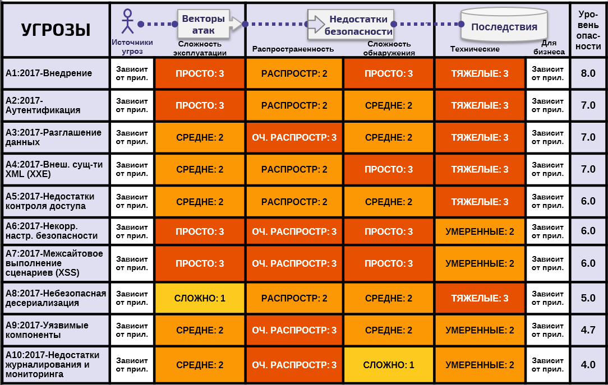

# **+ФР** О факторах риска угроз

## Сводная таблица угроз Топ-10

Таблица ниже содержит сводную информацию о Топ-10 угроз безопасности приложений 2017 г., а также факторы риска, назначенные для каждой из угроз. Эти факторы определялись на основе доступной статистики и опыта команды Топ-10 OWASP. Чтобы рассчитать риски для конкретного приложения или организации, необходимо определить специфичные для них источники угроз и последствия для бизнеса. Даже критические недостатки ПО могут не представлять серьезной опасности, если отсутствуют источники угроз или последствия для бизнеса являются незначительными для рассматриваемых активов.

## Дополнительные риски, требующие внимания

Помимо угроз, представленных в Топ-10, существуют другие риски, которые необходимо оценивать и учитывать. Некоторые из них уже описывались в прошлых версиях Топ-10, а некоторые — нет, включая новые техники атак, которые появляются постоянно. Ниже перечислены дополнительные угрозы безопасности приложений (по номеру CWE), на которые также необходимо обратить внимание:

* [CWE-352: Межсайтовая подмена запросов (CSRF)](https://cwe.mitre.org/data/definitions/352.html)
* [CWE-400: Неконтролируемое использование ресурсов ("Чрезмерное потребление ресурсов", "Отказ в обслуживании приложения")](https://cwe.mitre.org/data/definitions/400.html)
* [CWE-434: Отсутствие ограничений на загрузку файлов небезопасного типа](https://cwe.mitre.org/data/definitions/434.html)
* [CWE-451: Некорректное представление важной информации интерфейсом пользователя (Подмена интерфейса/курсора и прочее)](https://cwe.mitre.org/data/definitions/451.html)
* [CWE-601: Перенаправление на небезопасный сайт ("Открытая переадресация")](https://cwe.mitre.org/data/definitions/601.html)
* [CWE-799: Некорректное ограничение частоты взаимодействия (Противодействие автоматизации)](https://cwe.mitre.org/data/definitions/799.html)
* [CWE-829: Использование функций недоверенных источников (Сторонний контент)](https://cwe.mitre.org/data/definitions/829.html)
* [CWE-918: Подмена запросов на стороне сервера (SSRF)](https://cwe.mitre.org/data/definitions/918.html)

