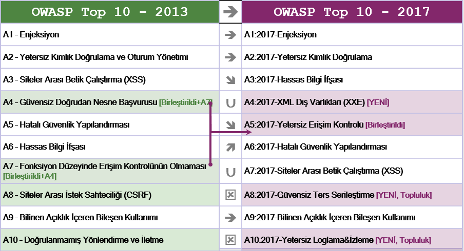

# RN Sürüm Notları

## 2013'ten 2017'ye Neler Değişti?

Son dört yıl içerisinde değişim hızlandı ve OWASP Top 10 projesini de değiştirme ihtiyacı doğdu. OWASP Top 10 projesi tamamen düzenlendi, metodoloji yenilendi, yeni bir veri talebi süreci oluşturuldu, topluluk ile beraber çalışıldı, riskler yeniden sıralandı, her bir risk baştan aşağı tekrar yazıldı ve yaygın olarak kullanılan diller ve kütüphaneler için referanslar eklendi.

Son birkaç yıl içerisinde, uygulamaların sahip olduğu temel teknolojiler ve mimari büyük ölçüde değişti:

* Node.js ve Spring Boot ile yazılan mikroservisler geleneksel monolitik uygulamaların yerini almaktadır. Mikroservisler, mikroservisler arasında güven, konteynerler, gizli bilgilerin yönetimi gibi kendilerine özgü pek çok güvenlik sorunları ile beraber gelmektedir. İnternet üzerinden erişilebilmesine kesinlikle ihtimal verilmeyen eski kodlar, şimdi Tek Sayfa Uygulamalar (SPAs) ve mobil uygulamalar tarafından tüketilmek üzere bir API veya REST servisi arkasında bulunmaktadır. Güvenilir servis tüketicileri gibi mimarisel varsayımlar artık geçerli olmamaktadır.
* Angular ve React gibi JavaScript kütüphaneleri ile yazılan tek sayfa uygulamalar, son derece modüler özellikler bakımından zengin ön uçların oluşturulmasına izin vermektedir. Geleneksel olarak sunucu tarafında sağlanan işlevlerin istemci tarafında olması kendi güvenlik sorunlarını da beraberinde getirmektedir.
* Sunucu tarafında çalışan Node.js ve istemci tarafında çalışan Bootstrap, Electron, Angular ve React gibi modern web kütüphaneleri ile JavaScript artık web uygulamalarının birincil programlama dili olmuştur.

## Verilerle desteklenen yeni sorunlar

* **A4:2017-XML Dış Varlıkları (XXE)** yaygın olarak kaynak kod analizi gerçekleştiren araçların([SAST](https://www.owasp.org/index.php/Source_Code_Analysis_Tools)) veri setleri tarafından desteklenen yeni bir kategoridir. 

## Topluluk tarafından desteklenen yeni sorunlar

İki ileriye yönelik açıklık kategorisi hakkında görüşlerini almak için topluluğa danıştık. 500'den fazla cevap değerlendirildikten ve verilerle desteklenen açıklıklar (Hassas Bilgi İfşası ve XXE) kaldırıldıktan sonra, aşağıdaki iki yeni açıklık eklenmiştir:
* **A8:2017-Güvensiz Ters İşleme**, etkilenen platformlar üzerinde uzaktan kod çalıştırılmasına veya hassas nesnelerin değiştirilmesine izin vermektedir.
* **A10:2017-Yetersiz Loglama ve İzleme**, eksikliği zararlı aktivitelerin ve ihlallerin tespitini, olay müdahalesini ve dijital adli bilişimi engelleyebilmekte veya önemli düzeyde geciktirebilmektedir.

## Unutulmamış ancak birleştirilmiş veya kaldırılmış sorunlar

* **A4-Güvensiz Doğrudan Nesne Başvuruları** ve **A7-Fonksiyon Düzeyinde Erişim Kontrolünün Olmaması**, **A5:2017-Yetersiz Erişim Kontrolü** başlığı altında birleştirilmiştir.
* **A8-Siteler Arası İstek Sahteciliği (CSRF)**, pek çok kütüphane [CSRF savunması](https://www.owasp.org/index.php/Cross-Site_Request_Forgery_(CSRF)) içerdiği için sadece uygulamaların %5'inde bulunmuştur.
* **A10-Doğrulanmamış Yönlendirme ve İletmeler**, uygulamaların %8'inde bulunmasına rağmen, XXE tarafından liste dışı bırakılmıştır.

