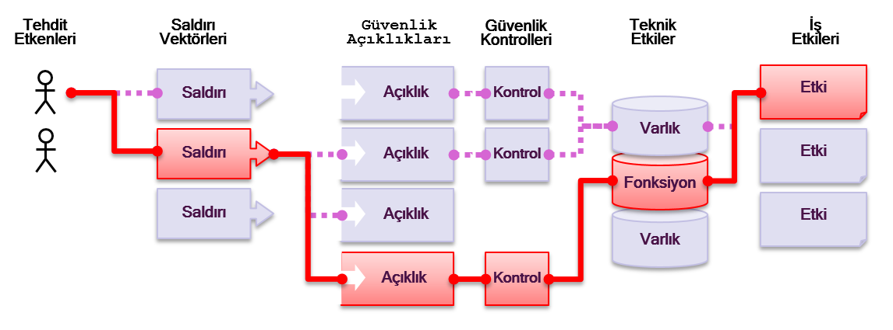

# Risk - Uygulama Güvenliği Riskleri

## Uygulama Güvenliği Riskleri Nelerdir?

Saldırganlar işinize veya organizasyonunuza zarar vermek için uygulamanız üzerinden farklı yollar deneyebilirler. Bu yolların herhangi birisi dikkat etmeyi gerektirecek kadar ciddi olabilecek veya olamayacak bir risk oluşturmaktadır.

Bazen bu yolların bulunması ve istismar edilmesi kolay olurken, bazen de son derece zor olabilmektedir. Benzer bir şekilde, oluşacak zarar da hiçbir öneme sahip olamayacağı gibi işinizi tehlikeye atabilecek boyutta da olabilmektedir. Organizasyonunuz için riskleri belirlerken, her bir tehdit etkeni ile ilişkilendirilen olasılığı, saldırı vektörünü ve güvenlik açığını değerlendirebilir ve bunu organizasyonunuz üzerinde bırakmasını tahmin ettiğiniz teknik ve iş etkileri ile birleştirebilirsiniz. 

## Risklerim Neler

[OWASP Top 10](https://www.owasp.org/index.php/Top10) farklı organizasyonlar için en ciddi web uygulaması güvenlik risklerini belirlemeye çalışmaktadır. Bu risklerin her biri için, OWASP Risk Belirleme Metodolojisi'ne dayanan aşağıdaki basit derecelendirme şemasını kullanarak olasılığı ve teknik etkisi hakkında genel bilgi sağlamaktayız.

| Tehdit Etkenleri | İstismar Edilebilirlik | Zafiyetin Yaygınlığı | Tespit Edilebilirlik | Teknik Etkiler | İş Etkileri |
| -- | -- | -- | -- | -- | -- |
| Uygu-   | Kolay 3 | Çok yaygın 3 | Kolay 3 | Ciddi 3 | İş     |
| lama   | Orta 2 | Yaygın 2 | Orta 2 | Orta 2 | Özel |
| özelinde | Zor 1 | Nadir 1 | Zor 1 | Önemsiz 1 |       |

Bu sürümde, herhangi bir risk için etki ve olasılık hesaplamasında yardımcı olmak için risk derecelendirme sistemini güncelledik. Daha fazla detay için, lütfen [Riskler Hakkında Notlar](0xc0-note-about-risks.md) kısmına bakınız.

Her organizasyon birbirinden farklıdır ve bunun sonucu olarak organizasyon için mevcut tehdit etkenleri, bunların amaçları ve herhangi bir ihlal durumunda etkileri de farklıdır. Kamu yararına hitap eden bir organizasyon ile hassas sağlık kayıtları içeren bir sağlık sistemi aynı içerik yönetim sistemini (CMS) kullansa bile, tehdit etkenleri ve iş etkileri aynı yazılım için birbirinden son derece farklı olacaktır. Bu yüzden, organizasyonunuz için var olan riskleri, uygulanabilir tehdit etkenleri ve iş etkilerini göz önünde bulundurarak anlamanız büyük önem taşımaktadır.

Mümkün olabildiğince, Top 10 içerisinde yer alan riskler, karmaşıklığı azaltmak ve genel olarak kabul görmüş adlandırma kurallarını teşvik etmek için [Common Weakness Enumeration](https://cwe.mitre.org/) (CWE) içerisinde yer alan açıklıklar ile benzer şekilde isimlendirilmiştir.

## Kaynaklar

### OWASP

* [OWASP Risk Rating Methodology](https://www.owasp.org/index.php/OWASP_Risk_Rating_Methodology)
* [Article on Threat/Risk Modeling](https://www.owasp.org/index.php/Threat_Risk_Modeling)

### Dış Kaynaklar

* [ISO 31000: Risk Management Std](https://www.iso.org/iso-31000-risk-management.html)
* [ISO 27001: ISMS](https://www.iso.org/isoiec-27001-information-security.html)
* [NIST Cyber Framework (US)](https://www.nist.gov/cyberframework)
* [ASD Strategic Mitigations (AU)](https://www.asd.gov.au/infosec/mitigationstrategies.htm)
* [NIST CVSS 3.0](https://nvd.nist.gov/vuln-metrics/cvss/v3-calculator)
* [Microsoft Threat Modelling Tool](https://www.microsoft.com/en-us/download/details.aspx?id=49168)
