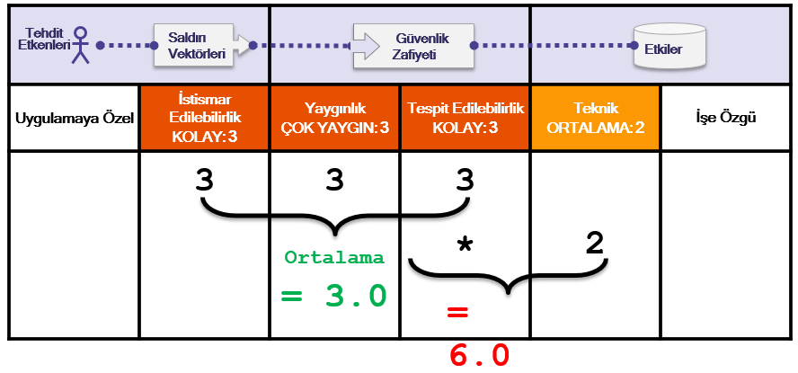

# +R Riskler Hakkında Not

## Zayıflıkların Temsil Ettiği Riskler Hakkında

Top 10 için Risk Derecelendirme metadolojisi  [OWASP Risk Derecelendirme Metadolojisi'ne](https://www.owasp.org/index.php/OWASP_Risk_Rating_Methodology) dayanmaktadır. Her bir Top 10 kategorisi için, ortak olasılık her bir ortak zayıflık için olasılık faktörlerine ve etki faktörlerine bakarak tipik bir web uygulamasında her bir zayıflığın oluşturacağı tipik riski tahmin ettik. Bir uygulamaya en önemli riski teşkil eden bu zayıflıklara göre sonrasında Top 10 listesini tekrar sıraladık. Bu faktörler, her bir yeni Top 10 sürümü ile bir şeyler değiştiğinde ve evrildiğinde güncellenmektedir.

[OWASP Risk Derecelendirme Metadolojisi](https://www.owasp.org/index.php/OWASP_Risk_Rating_Methodology) belirlenmiş bir açıklık için risk hesaplamasında yardımcı olmak için çok sayıda faktör tanımlamaktadır. Fakat, Top 10 gerçek uygulama ve API'lerdeki belirli açıklıklardan ziyade genellenebilir açıklıklardan bahsetmelidir. Sonuç olarak, Uygulamalar için risk hesaplanırken, hiçbir zaman uygulama sahipleri veya yöneticileri kadar net olamayacağız. Uygulamalarınızın ve verinizin önemi, tehditlerinizin ne olduğu ve sisteminizin nasıl geliştirildiği ve işletildiği konusunda hüküm vermek için en iyi şekilde donanımlısınız.

Metadolojimiz her bir zayıflık için üç olasılık faktörü (yaygınlık, tespit edilebilirlik ve istismarın kolaylığı) ve bir etki faktörü (teknik etki) içermektedir. Her bir faktöre özgü terminoloji ile risk her bir faktör için 1-Düşük ile 3-Yüksek arasında derecelenmektedir. Bir zayıflığın yaygınlığı, genellikle hesaplamak zorunda olmadığınız bir faktördür. Yaygınlık verisi için, (25. sayfadaki Teşekkürller kısmında bahsedildiği gibi) birtakım farklı organizasyonlardan yaygınlık istatistiği aldık ve yaygınlık açısından bir Top 10 varoluş olasılığı listesi oluşturmak için bu verileri birleştirdik. Her bir zayıflık için bir olasılık oranı yapmak için daha sonra bu veriler dğer iki olasılık faktörü (tespit edilebilirlik ve istismarın kolaylığı) ile birleştirildi. Olasılık oranı, Top 10 listesindeki her bir eleman için genel bir risk derecelendirmesi oluşturmak için her bir eleman için tahmin edilen ortalama teknik etki ile çarpılmıştır (sonuç yükseldikçe risk de artmaktadır). Tespit Edilebilirlik, İstismarın Kolaylığı ve Etki her bir Top 10 kategorisi ile ilişkilendirilen raporlanan CVE'ler analiz edilerek hesaplanmıştır. 

**Not**: Bu yaklaşım tehdit etkeni olasılığını hesaba katmamaktadır. Ayrıca belirli bir uygulamanız ile ilişkilendirilen çeşitli teknik detayların herhangi birisini de hesaba katmamaktadır. Bu faktörlerden herhangi birsi, saldırganın özel bir açıklığı bulması ve istismar etmesi olasılığını önemli derecede etkileyebilmektedir. Bu derecelendirme işiniz üzerindeki asıl etkiyi hesaba katmamaktadır. Kültürünüz, endüstri alanınız ve düzenleyici çevreniz düşünülerek, organizasyonunuz uygulama ve API'leri için kabul etmeye hazır olduğu güvenlik riski düzeyini belirlemek zorundadır. OWASP Top 10 listesinin amacı sizin adınıza bu risk analizini yapmak değildir.

Aşağıdaki tablo **A6:2017-Yanlış Güvenlik Yapılandırması** için risk hesaplamamızı göstermektedir.

