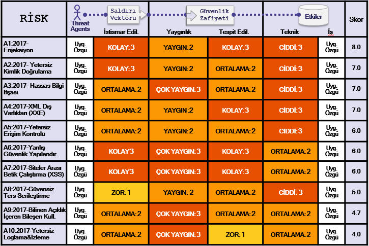

# +RF Risk Faktörleri Hakkında Detaylar

## Top 10 Risk Faktöleri Özeti

Aşağıdaki tablo 2017 Top 10 Uygulama Güvenliği Risklerini ve herbir risk için belirlediğimiz risk faktörlerinin bir özetini sunmaktadır. Bu faktörler hazır bulunan istatistik verilerine ve OWASP Top 10 takımının tecrübelerine göre belirlenmiştir. Belirli bir uygulama veya organizasyon için bu riskleri anlamak için, kendi tehdit etkenlerinizi ve iş etkilerinizi düşünmelisiniz. Gerekli saldırıyı gerçekleştirmek için bir tehdit etkeni bulunmuyorsa veya varlıklar için iş etkisi ihmal edilebilirse, ciddi yazılım açıklıkları bile ciddi bir risk oluşturmayabilmektedir.

## Düşünülmesi Gereken İlave Riskler

Top 10 pek çoğunu kapsamaktadır, ancak düşünmeniz ve değerlendirmeniz gereken başka pek çok risk organizasyonunuzda bulunmaktadır. Sürekli olarak keşfedilen yeni saldırı teknikleri dahil bunlardan bazıları daha önceki Top 10 sürümlerinde belirtilmişken, bazıları ise belirtilmemiştir. Düşünmeniz gereken ilave diğer önemli uygulama güvenliği riskleri (CWE-ID değerlerine göre sıralı) aşağıdakileri içermektedir:

* [CWE-352: Siteler Arası İstek Sahteciliği (CSRF)](https://cwe.mitre.org/data/definitions/352.html)
* [CWE-400: Kontrolsüz Kaynak Tüketimi ('Kaynak Tüketimi', 'AppDoS')](https://cwe.mitre.org/data/definitions/400.html)
* [CWE-434: Sınırsız Dosya Yükleme](https://cwe.mitre.org/data/definitions/434.html)
* [CWE-451: User Interface (UI) Misrepresentation of Critical Information (Clickjacking and others)](https://cwe.mitre.org/data/definitions/451.html)
* [CWE-601: Unvalidated Forward and Redirects](https://cwe.mitre.org/data/definitions/601.html)
* [CWE-799: Kontrolsüz Etkileşim Sıklığı (Anti-Otomasyon)](https://cwe.mitre.org/data/definitions/799.html)
* [CWE-829: Güvenilmeyen Fonksiyon Kullanımı (3. Parti İçerik)](https://cwe.mitre.org/data/definitions/829.html)
* [CWE-918: Sunucu Taraflı İstek Sahteciliği (SSRF)](https://cwe.mitre.org/data/definitions/918.html)

