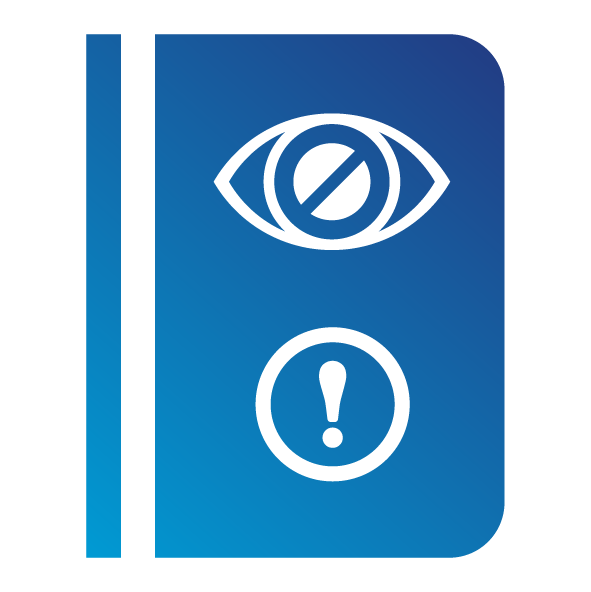

# A09:2025 Selhání bezpečnostního logování a upozorňování (Security Logging & Alerting Failures) {: style="height:80px;width:80px" align="right"}

## Pozadí

Selhání bezpečnostního logování a upozorňování si udržuje svou pozici na 9. místě. Název této kategorie byl mírně změněn, aby zdůraznil funkci upozorňování (alerting) potřebnou k vyvolání reakce na relevantní logovací události. Tato kategorie bude v datech vždy nedostatečně zastoupena a již potřetí ji účastníci komunitního průzkumu zvolili do seznamu Top 10.. Tato kategorie je mimořádně obtížná k testování a má minimální zastoupení v datech CVE/CVSS (pouze 723 záznamů CVE), ale může mít velký dopad na viditelnost, upozorňování na incidenty a forenzní analýzu. Tato kategorie zahrnuje problémy se *správným zpracováním enkódování výstupu do logovacích souborů (CWE-117), vkládáním citlivých dat do logovacích souborů (CWE-532) a nedostatečným logováním (CWE-778).*

## Tabulka skóre

<table>
  <tr>
   <td>Počet mapovaných CWE 
   </td>
   <td>Max míra výskytu
   </td>
   <td>Průměrná míra výskytu
   </td>
   <td>Max pokrytí
   </td>
   <td>Průměrné pokrytí
   </td>
   <td>Průměrná vážená zneužitelnost
   </td>
   <td>Průměrný vážený dopad
   </td>
   <td>Celkový počet výskytů
   </td>
   <td>Celkový počet CVE
   </td>
  </tr>
  <tr>
   <td>5
   </td>
   <td>11,33 %
   </td>
   <td>3,91 %
   </td>
   <td>85,96 %
   </td>
   <td>46,48 %
   </td>
   <td>7,19
   </td>
   <td>2,65
   </td>
   <td>260 288
   </td>
   <td>723
   </td>
  </tr>
</table>

## Popis 

Bez logování a monitorování nelze útoky a narušení zabezpečení odhalit a bez upozorňování je velmi obtížné během bezpečnostního incidentu rychle a efektivně reagovat. Nedostatečné logování, nepřetržité monitorování, detekce a upozorňování, které má iniciovat aktivní reakce, selhává vždy, když:

* Auditovatelné události, jako jsou přihlášení, neúspěšná přihlášení a transakce s vysokou hodnotou, nejsou logovány nebo jsou logovány nekonzistentně (například se logují pouze úspěšná přihlášení, ale ne neúspěšné pokusy).
* Varování a chyby negenerují žádné, nedostatečné nebo nejasné zprávy v logu.  
* Integrita logů není řádně chráněna před manipulací.
* Logy aplikací a API nejsou monitorovány z hlediska podezřelé aktivity.
* Logy jsou ukládány pouze lokálně a nejsou řádně zálohovány.
* Nejsou zavedeny nebo nejsou účinné vhodné prahové hodnoty pro upozorňování a procesy eskalace reakce. Upozornění nejsou přijímána nebo vyhodnocována v přiměřené lhůtě.
* Penetrační testování a skeny nástroji pro dynamické testování bezpečnosti aplikací (DAST) (například Burp nebo ZAP) nespouštějí upozornění.
* Aplikace nedokáže detekovat, eskalovat nebo upozornit na aktivní útoky v reálném čase nebo téměř v reálném čase.
* Jste zranitelní vůči úniku citlivých informací tím, že události logování a upozorňování jsou viditelné pro uživatele nebo útočníka (viz [A01:2025 Nedostatečné řízení přístupu (Broken Access Control)](A01_2025-Broken_Access_Control.md)), nebo tím, že logujete citlivé informace, které by neměly být logovány (například PII nebo PHI).
* Jste zranitelní vůči injektování nebo útokům na systémy logování nebo monitorování, pokud nejsou data logů správně enkódována.
* Aplikace opomíjí nebo nesprávně zpracovává chyby a jiné výjimečné stavy tak, že systém neví, že došlo k chybě, a proto není schopen logovat, že nastal problém.
* Adekvátní „use cases“ pro vydávání upozorňování chybí nebo jsou zastaralé, a proto nerozpoznají zvláštní situaci.
* Příliš mnoho falešně pozitivních upozornění znemožňuje odlišit důležitá upozornění od nedůležitých, což vede k tomu, že jsou rozpoznány příliš pozdě, nebo vůbec (fyzické přetížení týmu SOC).
* Zjištěná upozornění nelze správně zpracovat, protože playbook pro daný use case je neúplný, zastaralý nebo chybí.

## Jak tomu zabránit

Vývojáři by měli v závislosti na riziku aplikace implementovat některé nebo všechny z následujících kontrol:

* Zajistěte, aby všechna selhání přihlášení, selhání kontroly přístupu a selhání validace vstupů na straně serveru mohla být logována s dostatečným uživatelským kontextem pro identifikaci podezřelých nebo škodlivých účtů a aby byla uchovávána dostatečně dlouho pro účely opožděné forenzní analýzy.
* Zajistěte, aby byla logována každá část vaší aplikace, která obsahuje bezpečnostní kontrolu, bez ohledu na to, zda uspěje nebo selže.
* Zajistěte, aby byly logy generovány ve formátu, který mohou řešení pro správu logů snadno zpracovat.
* Zajistěte, aby data logů byla správně enkódována, aby se zabránilo injektování nebo útokům na logovací nebo monitorovací systémy.
* Zajistěte, aby všechny transakce měly auditní stopu s kontrolami integrity, které zabrání manipulaci nebo smazání, například append-only databázové tabulky nebo podobný mechanismus.
* Zajistěte, aby všechny transakce, které vyvolají chybu, byly rollbackovány a spuštěny znovu. Vždy fail closed (tj. bezpečně selžte; nepokračujte).
* Pokud se vaše aplikace nebo její uživatelé chovají podezřele, vyvolejte upozornění. Vytvořte pro vývojáře k tomuto tématu pokyny, aby s tím mohli v kódu počítat, nebo pro to zakupte systém.
* Týmy DevSecOps a bezpečnostní týmy by měly zavést účinné scénáře monitorování a upozorňování (use cases) včetně playbooků, aby tým Security Operations Center (SOC) podezřelé aktivity rychle detekoval a reagoval na ně.
* Přidejte do aplikace „honeytokeny“ jako pasti pro útočníky, např. do databáze nebo dat, jako skutečnou a/nebo technickou identitu uživatele. Jelikož se v běžném provozu nepoužívají, jakýkoli přístup generuje logovací data, na která lze vyvolat upozornění s téměř nulovým počtem falešných pozitiv (false positives).
* Analýza chování a podpora umělou inteligencí mohou být volitelně doplňkovou technikou, která podporuje nízkou míru falešně pozitivních upozornění.
* Vytvořte nebo přijměte plán reakce na incidenty a obnovy, například National Institute of Standards and Technology (NIST) 800-61r2 nebo novější. Naučte své softwarové vývojáře, jak vypadají útoky na aplikace a bezpečnostní incidenty, aby je mohli hlásit.

Existují komerční a open-source produkty pro ochranu aplikací, jako je OWASP ModSecurity Core Rule Set, a open-source software pro korelaci logů, jako je stack Elasticsearch, Logstash, Kibana (ELK), které nabízejí vlastní dashboardy a upozorňování a mohou vám pomoci tyto problémy řešit. Existují také komerční nástroje observability, které vám mohou pomoci na útoky reagovat nebo je blokovat téměř v reálném čase.

## Příklady scénářů útoků

**Scénář #1:** Provozovatel webových stránek poskytovatele dětského zdravotního pojištění/plánu nedokázal odhalit narušení bezpečnosti kvůli nedostatku monitorování a logování. Externí subjekt informoval poskytovatele zdravotního plánu, že útočník získal přístup k tisícům citlivých zdravotních záznamů více než 3,5 milionu dětí a upravil je. Postincidentní přezkum zjistil, že vývojáři webových stránek neřešili významné zranitelnosti. Jelikož systém nebyl logován ani monitorován, mohl únik dat probíhat již od roku 2013, tedy po dobu více než sedmi let.

**Scénář #2:** Velká indická letecká společnost zaznamenala únik dat zahrnující osobní údaje milionů cestujících za více než deset let, včetně údajů z pasů a kreditních karet. K úniku dat došlo u externího poskytovatele cloudového hostingu, který leteckou společnost o úniku po určité době informoval.

**Scénář #3:** Velká evropská letecká společnost utrpěla narušení zabezpečení, které podléhalo oznámení podle GDPR. Narušení bylo údajně způsobeno bezpečnostními zranitelnostmi v platební aplikaci, které útočníci zneužili a získali tak více než 400 000 záznamů o platbách zákazníků. Regulátor ochrany osobních údajů letecké společnosti v důsledku toho uložil pokutu ve výši 20 milionů liber.

## Reference

-   [OWASP Proactive Controls: C9: Implement Logging and Monitoring](https://top10proactive.owasp.org/archive/2024/the-top-10/c9-security-logging-and-monitoring/)

-   [OWASP Application Security Verification Standard: V16 Security Logging and Error Handling](https://github.com/OWASP/ASVS/blob/v5.0.0/5.0/en/0x25-V16-Security-Logging-and-Error-Handling.md)

-   [OWASP Cheat Sheet: Application Logging Vocabulary](https://cheatsheetseries.owasp.org/cheatsheets/Application_Logging_Vocabulary_Cheat_Sheet.html)

-   [OWASP Cheat Sheet: Logging](https://cheatsheetseries.owasp.org/cheatsheets/Logging_Cheat_Sheet.html)

-   [Data Integrity: Recovering from Ransomware and Other Destructive Events](https://csrc.nist.gov/publications/detail/sp/1800-11/final)

-   [Data Integrity: Identifying and Protecting Assets Against Ransomware and Other Destructive Events](https://csrc.nist.gov/publications/detail/sp/1800-25/final)

-   [Data Integrity: Detecting and Responding to Ransomware and Other Destructive Events](https://csrc.nist.gov/publications/detail/sp/1800-26/final)

-   [Real world example of such failures in Snowflake Breach](https://www.huntress.com/threat-library/data-breach/snowflake-data-breach)

## Seznam mapovaných CWE

* [CWE-117 Improper Output Neutralization for Logs](https://cwe.mitre.org/data/definitions/117.html)

* [CWE-221 Information Loss of Omission](https://cwe.mitre.org/data/definitions/221.html)

* [CWE-223 Omission of Security-relevant Information](https://cwe.mitre.org/data/definitions/223.html)

* [CWE-532 Insertion of Sensitive Information into Log File](https://cwe.mitre.org/data/definitions/532.html)

* [CWE-778 Insufficient Logging](https://cwe.mitre.org/data/definitions/778.html)
