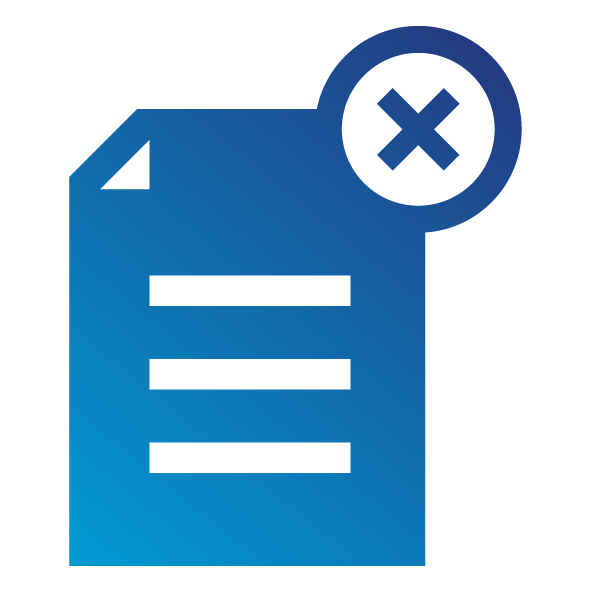

# A02:2025 Security Misconfiguration {: style="height:80px;width:80px" align="right"}

## Contesto.

Salendo dal #5 dell'edizione precedente, il 100% delle applicazioni testate è risultato avere qualche forma di configurazione errata, con un tasso medio di incidenza del 3,00% e oltre 719k occorrenze di una Common Weakness Enumeration (CWE) in questa categoria di rischio. Con lo spostamento sempre maggiore verso software altamente configurabile, non sorprende vedere questa categoria salire. Tra le CWE degne di nota vi sono *CWE-16 Configuration* e *CWE-611 Improper Restriction of XML External Entity Reference (XXE)*.

## Tabella dei punteggi.

<table>
  <tr>
   <td>CWE Mappate 
   </td>
   <td>Tasso Massimo di Incidenza
   </td>
   <td>Tasso Medio di Incidenza
   </td>
   <td>Copertura Massima
   </td>
   <td>Copertura Media
   </td>
   <td>Exploit Medio Ponderato
   </td>
   <td>Impatto Medio Ponderato
   </td>
   <td>Totale Occorrenze
   </td>
   <td>Totale CVE
   </td>
  </tr>
  <tr>
   <td>16
   </td>
   <td>27,70%
   </td>
   <td>3,00%
   </td>
   <td>100,00%
   </td>
   <td>52,35%
   </td>
   <td>7,96
   </td>
   <td>3,97
   </td>
   <td>719.084
   </td>
   <td>1.375
   </td>
  </tr>
</table>

## Descrizione.

La Security Misconfiguration si verifica quando un sistema, un'applicazione o un servizio cloud è configurato in modo errato dal punto di vista della sicurezza, creando vulnerabilità.

L'applicazione potrebbe essere vulnerabile se:

* Manca un adeguato hardening della sicurezza in qualsiasi parte dello stack applicativo o i permessi sui servizi cloud sono configurati in modo errato.
* Funzionalità non necessarie sono abilitate o installate (es. porte, servizi, pagine, account, framework di testing o privilegi non necessari).
* Gli account di default e le relative password sono ancora abilitati e non modificati.
* Manca una configurazione centrale per intercettare messaggi di errore eccessivi. La gestione degli errori rivela stack trace o altri messaggi di errore eccessivamente informativi agli utenti.
* Per i sistemi aggiornati, le ultime funzionalità di sicurezza sono disabilitate o non configurate in modo sicuro.
* Eccessiva priorità alla compatibilità con le versioni precedenti che porta a configurazioni non sicure.
* Le impostazioni di sicurezza nei server applicativi, nei framework applicativi (es. Struts, Spring, ASP.NET), nelle librerie, nei database, ecc. non sono impostate su valori sicuri.
* Il server non invia header o direttive di sicurezza, o non sono impostati su valori sicuri.

Senza un processo ripetibile e concertato di hardening della configurazione della sicurezza applicativa, i sistemi sono a rischio più elevato.

## Come prevenire.

Devono essere implementati processi di installazione sicuri, incluso:

* Un processo di hardening ripetibile che consenta la distribuzione rapida e semplice di un altro ambiente adeguatamente protetto. Gli ambienti di sviluppo, QA e produzione devono essere configurati in modo identico, con credenziali diverse utilizzate in ciascun ambiente. Questo processo deve essere automatizzato per minimizzare lo sforzo necessario per configurare un nuovo ambiente sicuro.
* Una piattaforma minimale senza funzionalità, componenti, documentazione o campioni non necessari. Rimuovere o non installare funzionalità e framework non utilizzati.
* Un'attività di revisione e aggiornamento delle configurazioni appropriate a tutte le note di sicurezza, aggiornamenti e patch come parte del processo di gestione delle patch (vedi [A03 Software Supply Chain Failures](A03_2025-Software_Supply_Chain_Failures.md)). Revisionare i permessi dello storage cloud (es. permessi dei bucket S3).
* Un'architettura applicativa segmentata che fornisca una separazione efficace e sicura tra componenti o tenant, con segmentazione, containerizzazione o gruppi di sicurezza cloud (ACL).
* Invio di direttive di sicurezza ai client, es. Security Headers.
* Un processo automatizzato per verificare l'efficacia delle configurazioni e delle impostazioni in tutti gli ambienti.
* Aggiungere proattivamente una configurazione centrale per intercettare messaggi di errore eccessivi come backup.
* Se queste verifiche non sono automatizzate, devono essere verificate manualmente almeno annualmente.
* Utilizzare la federazione di identità, credenziali di breve durata o meccanismi di accesso basati sui ruoli forniti dalla piattaforma sottostante anziché incorporare chiavi o segreti statici nel codice, nei file di configurazione o nelle pipeline.

## Scenari di attacco di esempio.

**Scenario #1:** Il server applicativo include applicazioni di esempio non rimosse dal server di produzione. Queste applicazioni di esempio hanno falle di sicurezza note che gli attaccanti utilizzano per compromettere il server. Supponiamo che una di queste applicazioni sia la console di amministrazione e che le credenziali predefinite non siano state cambiate. In tal caso, l'attaccante accede con la password predefinita e prende il controllo.

**Scenario #2:** Il directory listing non è disabilitato sul server. Un attaccante scopre che può semplicemente elencare le directory. L'attaccante trova e scarica le classi Java compilate, che decompila e fa reverse engineering per visualizzare il codice. L'attaccante trova quindi una grave falla nel controllo degli accessi nell'applicazione.

**Scenario #3:** La configurazione del server applicativo consente la restituzione di messaggi di errore dettagliati, come stack trace, agli utenti. Ciò potrebbe esporre informazioni sensibili o falle sottostanti, come le versioni dei componenti note per essere vulnerabili.

**Scenario #4:** Un cloud service provider (CSP) ha come default i permessi di condivisione aperti a Internet. Ciò consente l'accesso ai dati sensibili archiviati nello storage cloud.

## Riferimenti.

* [OWASP Testing Guide: Configuration Management](https://owasp.org/www-project-web-security-testing-guide/latest/4-Web_Application_Security_Testing/02-Configuration_and_Deployment_Management_Testing/README)
* [OWASP Testing Guide: Testing for Error Codes](https://owasp.org/www-project-web-security-testing-guide/stable/4-Web_Application_Security_Testing/08-Testing_for_Error_Handling/01-Testing_For_Improper_Error_Handling)
* [Application Security Verification Standard V13 Configuration](https://github.com/OWASP/ASVS/blob/master/5.0/en/0x22-V13-Configuration.md)
* [NIST Guide to General Server Hardening](https://csrc.nist.gov/publications/detail/sp/800-123/final)
* [CIS Security Configuration Guides/Benchmarks](https://www.cisecurity.org/cis-benchmarks/)
* [Amazon S3 Bucket Discovery and Enumeration](https://blog.websecurify.com/2017/10/aws-s3-bucket-discovery.html)

## Lista delle CWE Mappate

* [CWE-5 J2EE Misconfiguration: Data Transmission Without Encryption](https://cwe.mitre.org/data/definitions/5.html)
* [CWE-11 ASP.NET Misconfiguration: Creating Debug Binary](https://cwe.mitre.org/data/definitions/11.html)
* [CWE-13 ASP.NET Misconfiguration: Password in Configuration File](https://cwe.mitre.org/data/definitions/13.html)
* [CWE-15 External Control of System or Configuration Setting](https://cwe.mitre.org/data/definitions/15.html)
* [CWE-16 Configuration](https://cwe.mitre.org/data/definitions/16.html)
* [CWE-260 Password in Configuration File](https://cwe.mitre.org/data/definitions/260.html)
* [CWE-315 Cleartext Storage of Sensitive Information in a Cookie](https://cwe.mitre.org/data/definitions/315.html)
* [CWE-489 Active Debug Code](https://cwe.mitre.org/data/definitions/489.html)
* [CWE-526 Exposure of Sensitive Information Through Environmental Variables](https://cwe.mitre.org/data/definitions/526.html)
* [CWE-547 Use of Hard-coded, Security-relevant Constants](https://cwe.mitre.org/data/definitions/547.html)
* [CWE-611 Improper Restriction of XML External Entity Reference](https://cwe.mitre.org/data/definitions/611.html)
* [CWE-614 Sensitive Cookie in HTTPS Session Without 'Secure' Attribute](https://cwe.mitre.org/data/definitions/614.html)
* [CWE-776 Improper Restriction of Recursive Entity References in DTDs ('XML Entity Expansion')](https://cwe.mitre.org/data/definitions/776.html)
* [CWE-942 Permissive Cross-domain Policy with Untrusted Domains](https://cwe.mitre.org/data/definitions/942.html)
* [CWE-1004 Sensitive Cookie Without 'HttpOnly' Flag](https://cwe.mitre.org/data/definitions/1004.html)
* [CWE-1174 ASP.NET Misconfiguration: Improper Model Validation](https://cwe.mitre.org/data/definitions/1174.html)
