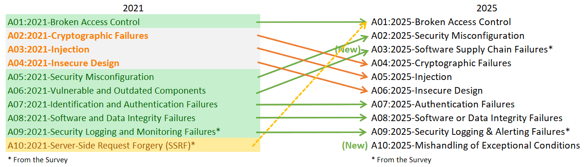

# 最も重大なウェブアプリケーションリスク　トップ10 (The Ten Most Critical Web Application Security Risks)

# イントロダクション (Introduction)

第8版となる「OWASP Top 10」へようこそ！

データ提供や調査にご協力いただいた皆様に、心より感謝申し上げます。皆様の知見なしには、今回の更新は成し得ませんでした。 **ありがとうございます！**

## OWASP Top 10:2025 の紹介

* [A01:2025 - アクセス制御の不備 (Broken Access Control)](A01_2025-Broken_Access_Control.md)
* [A02:2025 - セキュリティ設定の不備 (Security Misconfiguration)](A02_2025-Security_Misconfiguration.md)
* [A03:2025 - ソフトウェアサプライチェーンの不備 (Software Supply Chain Failures)](A03_2025-Software_Supply_Chain_Failures.md)
* [A04:2025 - 暗号化の不備 (Cryptographic Failures)](A04_2025-Cryptographic_Failures.md)
* [A05:2025 - インジェクション (Injection)](A05_2025-Injection.md)
* [A06:2025 - 安全性を欠いた設計 (Insecure Design)](A06_2025-Insecure_Design.md)
* [A07:2025 - 認証の不備 (Authentication Failures)](A07_2025-Authentication_Failures.md)
* [A08:2025 - ソフトウェアまたはデータの完全性の不備 (Software or Data Integrity Failures)](A08_2025-Software_or_Data_Integrity_Failures.md)
* [A09:2025 - セキュリティログとアラートの不備 (Security Logging and Alerting Failures)](A09_2025-Security_Logging_and_Alerting_Failures.md)
* [A10:2025 - 例外的な状況への不適切な対応 (Mishandling of Exceptional Conditions)](A10_2025-Mishandling_of_Exceptional_Conditions.md)

## 2025年版における主な変更点

2025年版では、2つのカテゴリが新設され、1つが統合されました。私たちは、表面的な「症状 (symptoms)」ではなく、可能な限り「根本原因 (root cause)」に焦点を当てるよう努めています。ソフトウェア開発とセキュリティの複雑さを考慮すると、カテゴリ間の重複を完全になくすことは事実上不可能です。

* **[A01:2025 - アクセス制御の不備](A01_2025-Broken_Access_Control.md)** は、最も深刻なリスクとして引き続き第1位となりました。テストされたアプリケーションの平均3.73%に、本カテゴリの40のCWE（共通弱点一覧 (Common Weakness Enumerations)）が1つ以上含まれています。上図の破線が示す通り、サーバーサイドリクエストフォージェリ (SSRF: Server-Side Request Forgery) は本カテゴリに統合されました。
* **[A02:2025 - セキュリティ設定の不備](A02_2025-Security_Misconfiguration.md)** は、2021年の第5位から第2位へと上昇しました。今回のデータでは設定の不備がより顕著に見られ、アプリケーションの3.00%に本カテゴリの16のCWEが含まれています。ソフトウェアエンジニアリングにおいて、アプリケーションの挙動が設定に依存する割合が増え続けている現状を反映しています。
* **[A03:2025 - ソフトウェアサプライチェーンの不備](A03_2025-Software_Supply_Chain_Failures.md)** は、2021年版の「[脆弱で古くなったコンポーネント (A06:2021-Vulnerable and Outdated Components)](https://owasp.org/Top10/A06_2021-Vulnerable_and_Outdated_Components/)」を拡張したものです。依存関係、ビルドシステム、配布インフラの全体にわたる侵害を対象としています。本カテゴリはコミュニティ調査で圧倒的な票を集めました。本カテゴリは5つのCWEを含み、収集データ上の出現頻度は限定的ですが、これはテストの困難さが原因と考えられ、この分野でのテスト手法の発展を期待しています。データ上で最も出現頻度が低い一方で、CVEにおける平均的な悪用可能性 (Exploit) と影響 (Impact) のスコアは最も高くなっています。
* **[A04:2025 - 暗号化の不備](A04_2025-Cryptographic_Failures.md)** は、第2位から第4位へ後退しました。平均3.80%のアプリケーションに、本カテゴリの32のCWEが含まれています。本不備は、機密情報の露出 (sensitive data exposure) やシステムの侵害 (system compromise) を招く恐れがあります。
* **[A05:2025 - インジェクション](A05_2025-Injection.md)** は、第3位から第5位へ順位を下げましたが、暗号化の不備や安全性を欠いた設計との相対的な位置関係は維持しています。最も多くテストされているカテゴリの一つであり、38のCWEに関連するCVE数が最大です。インジェクションには、クロスサイトスクリプティング (XSS)（高頻度・低影響）からSQLインジェクション（低頻度・高影響）まで、幅広い脆弱性が含まれます。
* **[A06:2025 - 安全性を欠いた設計](A06_2025-Insecure_Design.md)** は、セキュリティ設定の不備とソフトウェアサプライチェーンの不備に追い越され、第4位から第6位へ順位を下げました。2021年の導入以来、脅威モデリング (threat modeling) の普及など、安全な設計への意識向上と業界の進展が見られます。
* **[A07:2025 - 認証の不備](A07_2025-Authentication_Failures.md)** は、第7位を維持しました。旧名称「[識別と認証の不備 (Identification and Authentication Failures)](https://owasp.org/Top10/A07_2021-Identification_and_Authentication_Failures/)」から、本カテゴリの36のCWEをより正確に反映するため名称を変更しました。依然として重要な領域ですが、標準的な認証フレームワークの活用により、不備の発生が抑制され始めています。
* **[A08:2025 - ソフトウェアまたはデータの完全性の不備](A08_2025-Software_or_Data_Integrity_Failures.md)** は、引き続き第8位です。ソフトウェアサプライチェーンの不備よりも低いレベルで、信頼境界の維持や、ソフトウェア・コード・データの完全性検証の失敗に焦点を当てています。
* **[A09:2025 - セキュリティログとアラートの不備](A09_2025-Security_Logging_and_Alerting_Failures.md)** は、第9位を維持しました。旧名称「[セキュリティログと監視の不備 (Security Logging and Monitoring Failures)](https://owasp.org/Top10/A09_2021-Security_Logging_and_Monitoring_Failures/)」から、適切なアクションを促す「アラート機能」を強調するため名称を変更しました。アラートを伴わないログ出力には、インシデント特定においてほとんど価値がありません。本カテゴリはデータ上で常に過小評価される傾向にあり、今回もコミュニティ調査によってリストに選出されました。
* **[A10:2025 - 例外的な状況への不適切な対応](A10_2025-Mishandling_of_Exceptional_Conditions.md)** は、2025年版の新カテゴリです。エラー処理の不備やロジックエラー、フェイルオープンなど、異常状態に起因する24のCWEを含みます。

## 手法 (Methodology)

今回の OWASP Top 10 も、データに基づいた判断 (data-informed) を行っていますが、盲目的なデータ至上主義 (data-driven) ではありません。統計データから12のカテゴリをランク付けし、そのうち2つをコミュニティ調査の結果に基づいて選出・強調しました。これには根本的な理由があります。統計データを分析することは、本質的に「過去」を見ることだからです。アプリケーションセキュリティの研究者は、新しい脆弱性の特定や新しいテスト手法の開発に時間を費やしています。これらのテストをツールやプロセスに統合するには数週間から数年かかります。大規模に脆弱性を確実にテストできるようになる頃には、何年も経過している可能性があります。また、確実にテストすることができず、データに現れることがない重要なリスクも存在します。このような観点のバランスを取るため、現場の最前線にいるアプリケーションセキュリティや開発の実務者に、テストデータでは過小評価されている可能性のある重要なリスクについて意見を求めるコミュニティ調査を実施しています。

## カテゴリの構造

前バージョンの OWASP Top 10 からいくつかのカテゴリが変更されました。以下はカテゴリ変更の概要です。

今回は、2021年版のようなCWEの制限を設けずにデータを募集しました。特定の年（2021年以降）にテストされたアプリケーション数と、テストでCWEが1つ以上見つかったアプリケーション数を求めました。この形式により、アプリケーション全体におけるCWEの普及率を追跡できます。私たちの目的では頻度は無視しています。頻度は他の状況では必要かもしれませんが、アプリケーション全体における実際の普及率を隠してしまうからです。あるアプリケーションにCWEが4件あろうと4,000件あろうと、Top 10 の計算には含まれません。特に、手動テスターはアプリケーション内で何度繰り返されても脆弱性を1回だけ記載する傾向がありますが、自動テストフレームワークは脆弱性のすべてのインスタンスを個別にカウントするためです。分析対象のCWE数は、2017年の約30件から2021年の約400件、そして今回の589件へと増加しました。将来的には追加のデータ分析を補足として行う予定です。このCWE数の大幅な増加に伴い、カテゴリ構造の変更が必要となりました。

CWEのグループ化と分類には数ヶ月を費やしましたが、さらに続けることもできました。どこかで区切りをつける必要がありました。CWEには「根本原因 (root cause)」タイプと「症状 (symptom)」タイプの両方があります。根本原因タイプは「暗号化の不備」や「設定の不備」などであり、症状タイプは「機密情報の露出」や「サービス拒否」などです。私たちは、特定と修正のガイダンスを提供するうえでより論理的であるため、可能な限り根本原因に焦点を当てることにしました。症状よりも根本原因に焦点を当てることは新しい概念ではありません。Top 10 はこれまでも症状と根本原因が混在していました。CWEも症状と根本原因が混在しています。私たちは単にそれをより意識的に明示しているだけです。今回のカテゴリあたりの平均CWE数は25件で、A03:2025（ソフトウェアサプライチェーンの不備）とA09:2025（セキュリティログとアラートの不備）の5件から、A01:2025（アクセス制御の不備）の40件までの範囲となっています。1カテゴリあたりのCWE数を40件に制限する決定を行いました。この更新されたカテゴリ構造は、企業が言語やフレームワークに適したCWEに集中できるため、トレーニング上の利点も提供します。

MITRE Top 25 Most Dangerous Software Weaknesses のように、Top 10 を10個のCWEのリストに変更しないのかという質問を受けることがあります。カテゴリに複数のCWEを使用する主な理由は2つあります。第一に、すべてのCWEがすべてのプログラミング言語やフレームワークに存在するわけではないからです。これにより、Top 10 の一部が適用できない場合、ツールやトレーニング・啓発プログラムに問題が生じます。第二に、一般的な脆弱性には複数のCWEが存在するからです。たとえば、一般的なインジェクション、コマンドインジェクション、クロスサイトスクリプティング、ハードコードされたパスワード、検証の欠如、バッファオーバーフロー、機密情報の平文保存など、多くの脆弱性に複数のCWEがあります。組織やテスターによって、異なるCWEが使用される場合があります。複数のCWEを含むカテゴリを使用することで、共通のカテゴリ名の下で発生する可能性のある様々な弱点の種類についてベースラインと認識を高めることができます。Top 10 2025 には、10のカテゴリ内に248のCWEが含まれています。本リリース時点で、[MITREからダウンロード可能な辞書](https://cwe.mitre.org)には合計968のCWEがあります。

## カテゴリ選定におけるデータの活用

2021年版と同様に、CVEデータを活用して「悪用可能性 (Exploitability)」と「技術面への影響 ((Technical) Impact)」を算出しました。OWASP Dependency Check をダウンロードし、CVEに記載された関連CWEごとにCVSSのExploitスコアとImpactスコアを抽出・グループ化しました。これには相当の調査と労力を要しました。すべてのCVEにはCVSSv2スコアがありますが、CVSSv2には欠陥があり、CVSSv3で対処されるべきものです。ある時点以降、すべてのCVEにはCVSSv3スコアも割り当てられています。また、CVSSv2とCVSSv3の間でスコアリング範囲と計算式が更新されました。

CVSSv2では、ExploitとImpactの両方が最大10.0になる可能性がありましたが、計算式によりExploitは60%、Impactは40%に低減されていました。CVSSv3では、理論上の最大値はExploitが6.0、Impactが4.0に制限されました。重み付けを考慮すると、ImpactスコアはCVSSv3で平均約1.5ポイント高くなり、Exploitabilityは平均約0.5ポイント低くなりました。

OWASP Dependency Check から抽出した National Vulnerability Database (NVD) には、CWEにマッピングされた約17万5千件（2021年の12万5千件から増加）のCVEレコードがあります。また、CVEにマッピングされたユニークなCWEは643件（2021年の241件から増加）あります。抽出された約22万件のCVEのうち、16万件がCVSS v2スコア、15万6千件がCVSS v3スコア、6千件がCVSS v4スコアを持っています。多くのCVEが複数のスコアを持つため、合計は22万件を超えます。

Top 10 2025 では、以下の方法で平均ExploitスコアとImpactスコアを計算しました。CVSSスコアを持つすべてのCVEをCWEごとにグループ化し、CVSSv3を持つ母集団の割合と、残りのCVSSv2を持つ母集団でExploitスコアとImpactスコアの両方を重み付けして、全体の平均を算出しました。これらの平均をデータセット内のCWEにマッピングし、リスク方程式のもう半分としてExploitスコアと（技術面への）Impactスコアとして使用しました。

CVSS v4.0 を使用しないのはなぜかと思われるかもしれません。これは、スコアリングアルゴリズムが根本的に変更され、CVSS v2やCVSSv3のように「Exploit」や「Impact」スコアを簡単に提供できなくなったためです。Top 10 の将来のバージョンでCVSS v4.0スコアを使用する方法を検討する予定ですが、2025年版では適時に対応する方法を見つけることができませんでした。

## コミュニティ調査の意義

統計データの結果は、業界が自動化された方法でテストできる範囲に大きく限定されています。経験豊富なAppSec専門家に話を聞けば、まだデータに現れていない発見やトレンドを教えてくれるでしょう。特定の脆弱性タイプのテスト手法を開発するには時間がかかり、さらにそれらのテストを自動化して大規模なアプリケーション群に対して実行するにはさらに時間がかかります。私たちが見つけるものはすべて過去を振り返っており、データに現れていない直近1年のトレンドを見逃している可能性があります。

したがって、データが不完全であるため、10カテゴリのうち8つのみをデータから選出しています。残りの2つのカテゴリはTop 10コミュニティ調査から選出しています。これにより、現場の最前線にいる実務者が、データに現れていない（そして永久にデータに現れない可能性のある）最も高いリスクと考えるものに投票できます。

## データ提供者の皆様への謝辞

以下の組織（および複数の匿名提供者）から、280万件以上のアプリケーションに関する貴重なデータをご提供いただき、史上最大かつ最も包括的なアプリケーションセキュリティデータセットとなりました。皆さんのおかげです。ありがとうございました。

* Accenture (Prague)
* Anonymous (multiple)
* Bugcrowd
* Contrast Security
* CryptoNet Labs
* Intuitor SoftTech Services
* Orca Security
* Probely
* Semgrep
* Sonar
* usd AG
* Veracode
* Wallarm

## 主執筆者 (Lead Authors)
* Andrew van der Stock - X: [@vanderaj](https://x.com/vanderaj)
* Brian Glas - X: [@infosecdad](https://x.com/infosecdad)
* Neil Smithline - X: [@appsecneil](https://x.com/appsecneil)
* Tanya Janca - X: [@shehackspurple](https://x.com/shehackspurple)
* Torsten Gigler - Mastodon: [@torsten_gigler@infosec.exchange](https://infosec.exchange/@torsten_gigler)

## 課題の報告およびプルリクエスト

修正や課題の報告はこちらからお願いします。

### プロジェクトリンク：
* [ホームページ](https://owasp.org/www-project-top-ten/)
* [GitHub リポジトリ](https://github.com/OWASP/Top10)

