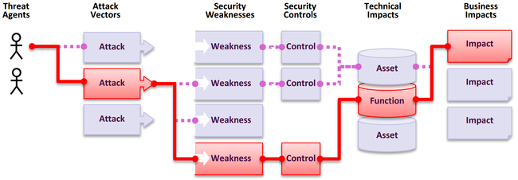

# アプリケーションセキュリティのリスクとは？ (What are Application Security Risks?)

攻撃者は、アプリケーション内のさまざまな経路を悪用し、ビジネスや組織に損害を与える恐れがあります。これらの経路の一つひとつが潜在的なリスクであり、慎重な調査が必要です。

<table>
  <tr>
   <td>
    <strong>脅威主体 (Threat Agents)</strong>
   </td>
   <td>
    <strong>攻撃ベクトル (Attack Vectors)</strong>
   </td>
   <td>
    <strong>悪用可能性 (Exploitability)</strong>
   </td>
   <td>
    <strong>セキュリティ制御の 欠如による可能性 (Likelihood of Missing Security Controls)</strong>
   </td>
   <td>
    <strong>技術面への影響 (Technical Impacts)</strong>
   </td>
   <td>
    <strong>ビジネス面への影響 (Business Impacts)</strong>
   </td>
  </tr>
  <tr>
   <td>
    <strong>環境や状況把握に基づく動的な変化</strong>
   </td>
   <td>
    <strong>アプリケーションの露出状況（環境別）</strong>
   </td>
   <td>
    <strong>平均加重悪用スコア</strong>
   </td>
   <td>
    <strong>平均出現率に基づく制御の欠如 （テスト網羅率で加重）</strong>
   </td>
   <td>
    <strong>平均加重影響スコア</strong>
   </td>
   <td>
    <strong>ビジネス固有の影響</strong>
   </td>
  </tr>
</table>

OWASPのリスク格付けでは、悪用可能性、弱点に対するセキュリティ制御の欠如による平均的な可能性、および技術面への影響という普遍的なパラメータを考慮しています。

ただし、組織、脅威主体の目的、侵害時の影響はそれぞれ異なります。たとえば、同じコンテンツ管理システム (CMS) を使用していても、公益法人が「公開情報」を扱う場合と、医療機関が「機微な健康情報」を扱う場合では、脅威主体やビジネス面への影響は大きく異なります。アプリケーションの露出状況、状況把握 (Situation Picture) に基づく適切な脅威主体、および個別のビジネス面への影響を考慮し、自組織におけるリスクを理解することが不可欠です。

## カテゴリの選定と順位付けへのデータ活用方法

OWASP Top 10 のカテゴリ選定手法は、時代とともに進化してきました。2017年版では出現率 (Incidence Rate) を中心に評価し、チーム内での議論に基づき順位を決定していました。2021年版からは、脆弱性データベース (NVD: National Vulnerability Database) の CVSS スコアを活用した手法へ移行し、2025年版でもこの手法を継承しています。

評価にあたっては、OWASP Dependency Check を用いて、各 CWE (共通弱点一覧) に関連付けられた CVE (共通脆弱性識別子) の CVSS スコアを抽出しました。CVSS v2 には課題があるため、現在は v3 スコアへの移行が進んでいますが、両者の計算式や重み付けには差異があります。たとえば CVSS v3 では、v2 に比べて影響 (Impact) スコアが平均して約1.5ポイント高く算出され、悪用可能性 (Exploitability) は約0.5ポイント低くなる傾向があります。

今回の分析対象となった CWE は 643 件にのぼり（2021年は 241 件）、約 22 万件の CVE データを精査しました。

2025年版のリスクスコアは、各 CWE に紐づく CVSS v2 および v3 のスコアを加重平均して算出しています。なお、CVSS v4.0 はアルゴリズムが根本的に変更されており、現時点では従来のような比較が困難なため、今回の採用は見送りました。

出現率の算出にあたっては、「問題が何回発生したか（頻度）」ではなく、「テストされたアプリケーション全体のうち、何パーセントにその CWE が存在したか」を重視しています。また、網羅率 (Coverage) を考慮することで、サンプルサイズが十分であるかを確認し、出現率の精度を担保しています。

今回使用した計算式は以下の通りです。
**(最大出現率% * 1000) + (最大網羅率% * 100) + (平均悪用スコア * 10) + (平均影響スコア * 20) + (出現総数 / 10000) = リスクスコア**

この式で算出されたスコアは、「アクセス制御の不備」の 621.60 から、「メモリ管理エラー」の 271.08 まで多岐にわたります。

今後の課題は、「アプリケーション」の定義が変化している点です。マイクロサービス化が進む現状では、従来のアプリケーション単位での計算が難しくなっています。次回の Top 10 では、こうした業界の変化を反映した評価手法の調整が必要になるでしょう。

## データ要素 (Data Factors)

各カテゴリに記載されているデータ要素の意味は以下の通りです。

**CWEs Mapped (紐付けられたCWE数):** 各カテゴリに割り当てられた CWE の総数。

**Incidence Rate (出現率):** 調査対象のアプリケーション群のうち、その CWE が一つ以上見つかったアプリケーションの割合。

**Weighted Exploit (加重悪用スコア):** CWE に紐づく CVE の CVSS 悪用可能性サブスコアを正規化し、10段階で評価したもの。

**Weighted Impact (加重影響スコア):** CWE に紐づく CVE の CVSS 影響サブスコアを正規化し、10段階で評価したもの。

**(Testing) Coverage (テスト網羅率):** すべての組織において、その CWE を対象としたテストが行われたアプリケーションの割合。

**Total Occurrences (出現総数):** そのカテゴリに属する CWE が見つかったアプリケーションの延べ数。

**Total CVEs (CVE総数):** NVD データベース上で、そのカテゴリ内の CWE に紐付けられている CVE の総数。

**Formula (計算式):** (最大出現率% * 1000) + (最大網羅率% * 100) + (平均悪用スコア * 10) + (平均影響スコア * 20) + (出現総数 / 10000) = リスクスコア

