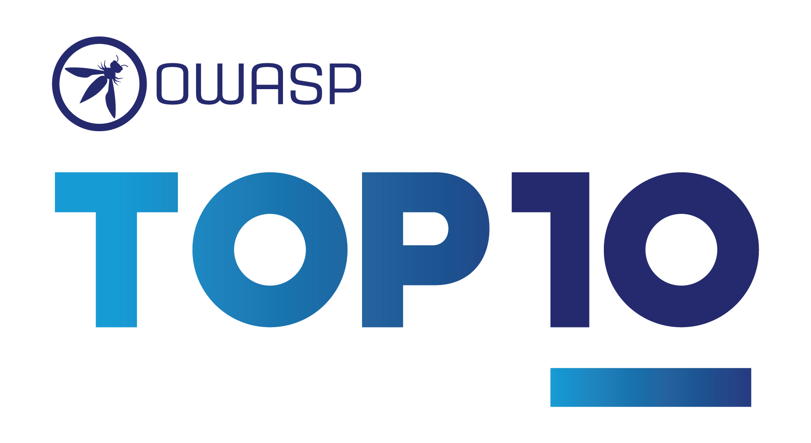

# 十大最关键的 Web 应用安全风险

# 引言

欢迎来到 OWASP Top Ten 的第八版！

衷心感谢所有在调查中贡献数据和观点的人。没有你们，这一版就不可能完成。**谢谢你们！**

## 介绍 OWASP Top 10:2025

* [A01:2025 - 访问控制失效](A01_2025-Broken_Access_Control.md)
* [A02:2025 - 安全配置错误](A02_2025-Security_Misconfiguration.md)
* [A03:2025 - 软件供应链故障](A03_2025-Software_Supply_Chain_Failures.md)
* [A04:2025 - 加密机制失效](A04_2025-Cryptographic_Failures.md)
* [A05:2025 - 注入](A05_2025-Injection.md)
* [A06:2025 - 不安全设计](A06_2025-Insecure_Design.md)
* [A07:2025 - 认证失效](A07_2025-Authentication_Failures.md)
* [A08:2025 - 软件或数据完整性失效](A08_2025-Software_or_Data_Integrity_Failures.md)
* [A09:2025 - 安全日志记录与告警失效](A09_2025-Security_Logging_and_Alerting_Failures.md)
* [A10:2025 - 异常条件处理不当](A10_2025-Mishandling_of_Exceptional_Conditions.md)

## 2025 年 Top 10 的变化

2025 年的 Top Ten 中有两个新类别和一个合并项。我们尽可能保持对根本原因的关注，而非症状。鉴于软件工程和软件安全的复杂性，要创建十个完全没有重叠的类别几乎是不可能的。

* **[A01:2025 - 访问控制失效](A01_2025-Broken_Access_Control.md)** 保持在第一的位置，是最严重的应用安全风险；贡献的数据表明，平均有 3.73% 的测试应用存在该类别中 40 个常见弱点枚举（CWE）中的一个或多个。如上图中的虚线所示，服务器端请求伪造（SSRF）已被纳入此类别。
* **[A02:2025 - 安全配置错误](A02_2025-Security_Misconfiguration.md)** 从 2021 年的第五上升到 2025 年的第二。在本周期的数据中，配置错误更为普遍。3.00% 的测试应用存在该类别中 16 个 CWE 中的一个或多个。这并不令人意外，因为软件工程正持续增加基于配置的应用行为数量。
* **[A03:2025 - 软件供应链故障](A03_2025-Software_Supply_Chain_Failures.md)** 是 [A06:2021-Vulnerable and Outdated Components](https://owasp.org/Top10/A06_2021-Vulnerable_and_Outdated_Components/) 的扩展，涵盖了软件依赖、构建系统和分发基础设施整个生态系统中发生的更广泛危害。在社区调查中，这一类别被压倒性地投票为最受关注的问题。该类别包含 5 个 CWE，在收集的数据中出现较少，但我们认为这是由于测试挑战所致，并希望测试能在这方面迎头赶上。该类别在数据中出现次数最少，但来自 CVE 的平均利用和影响得分最高。
* **[A04:2025 - 加密机制失效](A04_2025-Cryptographic_Failures.md)** 从第二下降到第四。贡献的数据表明，平均有 3.80% 的应用存在该类别中 32 个 CWE 中的一个或多个。该类别常导致敏感数据泄露或系统受损。
* **[A05:2025 - 注入](A05_2025-Injection.md)** 从第三下降到第五，相对于加密失败和不安全设计保持其位置。注入是测试最多的类别之一，与该类别中 38 个 CWE 相关的 CVE 数量最多。注入包括从跨站脚本（高频率/低影响）到 SQL 注入（低频率/高影响）漏洞的一系列问题。
* **[A06:2025 - 不安全设计](A06_2025-Insecure_Design.md)** 从第四下滑到第六，因为安全配置错误和软件供应链失败超越了它。该类别于 2021 年引入，我们注意到行业在威胁建模方面有了显著改进，并更加重视安全设计。
* **[A07:2025 - 认证失效](A07_2025-Authentication_Failures.md)** 保持在第七的位置，名称略有更改（之前是“[Identification and Authentication Failures](https://owasp.org/Top10/A07_2021-Identification_and_Authentication_Failures/)”），以更准确地反映该类别中的 36 个 CWE。该类别仍然重要，但标准化身份验证框架的广泛使用似乎对身份验证失败的发生率产生了积极影响。
* **[A08:2025 - 软件或数据完整性失效](A08_2025-Software_or_Data_Integrity_Failures.md)** 继续排在第八。该类别侧重于未能维护信任边界，以及在比软件供应链失败更低的层面上验证软件、代码和数据工件的完整性。
* **[A09:2025 - 安全日志记录与告警失效](A09_2025-Security_Logging_and_Alerting_Failures.md)** 保持在第九的位置。该类别名称略有更改（之前是“[Security Logging and Monitoring Failures](https://owasp.org/Top10/A09_2021-Security_Logging_and_Monitoring_Failures/)”），以强调告警功能的重要性，该功能用于对相关日志事件触发适当行动。没有告警的出色日志记录在识别安全事件方面价值极小。该类别在数据中始终代表性不足，并再次由社区调查参与者投票进入列表。
* **[A10:2025 - 异常条件处理不当](A10_2025-Mishandling_of_Exceptional_Conditions.md)** 是 2025 年的新类别。该类别包含 24 个 CWE，侧重于不当错误处理、逻辑错误、开放失败，以及系统可能遇到的异常情况导致的其他相关场景。

## 方法论

本版 Top Ten 仍然基于数据，但并非盲目数据驱动。我们根据贡献的数据对 12 个类别进行了排名，并允许两个类别通过社区调查的回应被提升或突出。我们这样做有一个根本原因：检查贡献的数据本质上是在回顾过去。应用安全研究人员投入时间识别新漏洞并开发新测试方法。将这些测试集成到工具和流程中需要数周到数年的时间。等到我们能大规模可靠地测试一个弱点时，可能已经过去数年。还有一些重要风险可能永远无法可靠测试并出现在数据中。为了平衡这一观点，我们使用社区调查来询问一线应用安全和开发从业者，他们认为哪些重要风险可能在测试数据中代表性不足。

## 类别的结构方式

与 OWASP Top Ten 上一版相比，一些类别发生了变化。以下是类别变更的高层总结。

在本轮中，我们要求提供数据，但没有像 2021 版那样对 CWE 进行限制。我们要求提供给定年份（从 2021 年开始）测试的应用数量，以及在测试中发现至少一个 CWE 实例的应用数量。这种格式使我们能够追踪每个 CWE 在应用群体中的普遍程度。我们忽略频率；虽然在其他情况下可能必要，但它只会掩盖应用群体中的实际普遍性。一个应用有四个 CWE 实例还是 4000 个实例，并不计入 Top Ten 的计算。特别是手动测试人员往往只列出一次漏洞，无论它在应用中重复多少次，而自动化测试框架则将每个漏洞实例视为唯一。我们从 2017 年的约 30 个 CWE，到 2021 年的近 400 个 CWE，再到本版的 589 个 CWE 用于数据集分析。我们计划未来进行额外的数据分析作为补充。CWE 数量的显著增加要求对类别结构进行更改。

我们花了数月时间对 CWE 进行分组和分类，本可以再继续数月。我们必须在某个点停止。既有根本原因类型的 CWE，也有症状类型的 CWE，根本原因类型如“加密失败”和“配置错误”，而症状类型如“敏感数据泄露”和“拒绝服务”。我们决定尽可能关注根本原因，因为这对于提供识别和修复指导更为合理。关注根本原因而非症状并非新概念；Top Ten 一直是症状和根本原因的混合。CWE 也是症状和根本原因的混合；我们只是更刻意地指出这一点。本版每个类别平均有 25 个 CWE，下限为 A03:2025-软件供应链失败和 A09:2025 安全日志记录和告警失败的 5 个 CWE，上限为 A01:2025-失效访问控制的 40 个 CWE。我们决定将每个类别的 CWE 数量上限设为 40。这种更新的类别结构提供了额外的培训优势，因为公司可以专注于对语言/框架有意义的 CWE。

有人问为什么不转向类似 MITRE Top 25 最危险软件弱点的 10 个 CWE 列表。我们使用类别中包含多个 CWE 有两个主要原因。首先，并非所有 CWE 都存在于所有编程语言或框架中。这会导致工具和培训/意识计划的问题，因为 Top Ten 的部分内容可能不适用。第二个原因是常见漏洞有多个 CWE。例如，通用注入、命令注入、跨站脚本、硬编码密码、缺乏验证、缓冲区溢出、明文存储敏感信息等都有多个 CWE。根据组织或测试者的不同，可能会使用不同的 CWE。通过使用包含多个 CWE 的类别，我们可以帮助提高基线和对常见类别名称下可能发生的不同类型弱点的认识。在 2025 版 Top Ten 中，10 个类别中共有 248 个 CWE。在发布时，[downloadable dictionary from MITRE](https://cwe.mitre.org) 中共有 968 个 CWE。

## 数据如何用于选择类别

与 2021 版类似，我们利用 CVE 数据来评估*可利用性*和*（技术）影响*。我们下载了 OWASP Dependency Check，并提取了 CVSS 利用和影响得分，按 CVE 中列出的相关 CWE 进行分组。这需要相当多的研究和努力，因为所有 CVE 都有 CVSSv2 得分，但 CVSSv2 存在 CVSSv3 应解决的问题。在某个时间点之后，所有 CVE 也被分配了 CVSSv3 得分。此外，CVSSv2 和 CVSSv3 之间的评分范围和公式也进行了更新。

在 CVSSv2 中，利用和（技术）影响最高可达 10.0，但公式会将其降低到利用占 60%，影响占 40%。在 CVSSv3 中，理论最大值限制为利用 6.0，影响 4.0。考虑到权重，影响得分平均提高了近 1.5 分，而可利用性平均降低了近 0.5 分。

从 OWASP Dependency Check 中提取的、映射到 CWE 的 CVE 记录约有 17.5 万条（高于 2021 年的 12.5 万条）。此外，有 643 个独特的 CWE 映射到 CVE（高于 2021 年的 241 个）。在提取的近 22 万条 CVE 中，16 万条有 CVSS v2 得分，15.6 万条有 CVSS v3 得分，6 千条有 CVSS v4 得分。许多 CVE 有多个得分，因此总数超过 22 万。

对于 Top Ten 2025，我们按以下方式计算了平均利用和影响得分。我们将所有有 CVSS 得分的 CVE 按 CWE 分组，并根据具有 CVSSv3 得分的群体百分比以及剩余具有 CVSSv2 得分的群体，对利用和影响得分进行加权，以获得总体平均值。我们将这些平均值映射到数据集中的 CWE，用作风险方程另一部分的利用和（技术）影响得分。

你可能会问，为什么不用 CVSS v4.0？这是因为评分算法发生了根本性变化，不再像 CVSS v2 和 CVSSv3 那样容易提供*利用*或*影响*得分。我们将尝试找出在 Top Ten 未来版本中使用 CVSS v4.0 评分的方法，但无法及时为 2025 版确定可行方案。

## 为什么使用社区调查

数据中的结果主要限于行业能以自动化方式测试的内容。与经验丰富的 AppSec 专业人士交谈，他们会告诉你他们发现的东西以及看到的趋势，这些尚未出现在数据中。人们需要时间开发针对某些漏洞类型的测试方法，然后需要更多时间将这些测试自动化并针对大量应用运行。我们发现的每件事都是在回顾过去，可能遗漏了去年的趋势，而这些趋势并未出现在数据中。

因此，我们只从数据中选取十个类别中的八个，因为它是不完整的。另外两个类别来自 Top 10 社区调查。这允许一线从业者投票选出他们认为可能不在数据中（且可能永远无法在数据中体现）的最高风险。

## 感谢我们的数据贡献者

以下组织（以及几位匿名捐赠者）慷慨捐赠了超过 280 万个应用的数据，使其成为最大、最全面的应用安全数据集。没有你们，这是不可能的。

* Accenture (Prague)
* Anonymous (multiple)
* Bugcrowd
* Contrast Security
* CryptoNet Labs
* Intuitor SoftTech Services
* Orca Security
* Probely
* Semgrep
* Sonar
* usd AG
* Veracode
* Wallarm

## 主要作者
* Andrew van der Stock - X: [@vanderaj](https://x.com/vanderaj)
* Brian Glas - X: [@infosecdad](https://x.com/infosecdad)
* Neil Smithline - X: [@appsecneil](https://x.com/appsecneil)
* Tanya Janca - X: [@shehackspurple](https://x.com/shehackspurple)
* Torsten Gigler - Mastodon: [@torsten_gigler@infosec.exchange](https://infosec.exchange/@torsten_gigler)

## 记录问题和拉取请求

请记录任何更正或问题：

### 项目链接：
* [Homepage](https://owasp.org/www-project-top-ten/)
* [GitHub repository](https://github.com/OWASP/Top10)